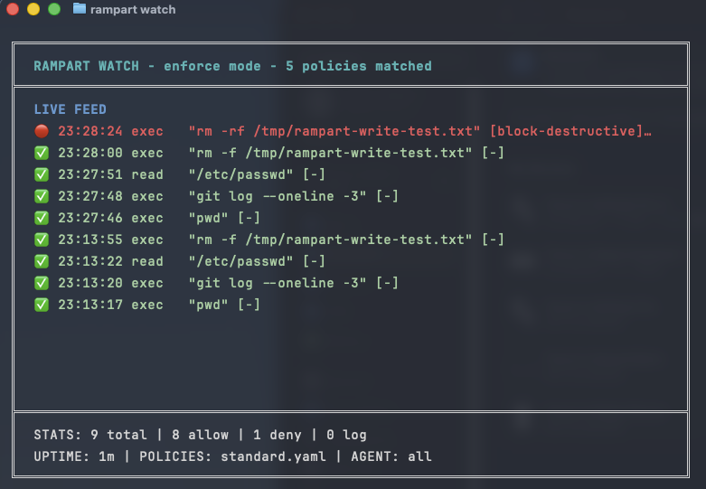

<div align="center">

# 🛡️ Rampart

**A firewall for AI coding agents.**

[](https://go.dev)
[](LICENSE)
[](https://github.com/peg/rampart/actions/workflows/ci.yml)
[](https://github.com/peg/rampart/releases)
[](https://docs.rampart.sh)

</div>

---

Claude Code's `--dangerously-skip-permissions` mode — and similar autonomous modes in Cline and Codex — give agents unrestricted shell access. Your agent can read your SSH keys, exfiltrate your `.env`, or `rm -rf /` with no guardrails.

Rampart sits between the agent and your system. Every command, file access, and network request is evaluated against your policy before it executes. Dangerous commands never run.

---

## Install

```bash
# Homebrew (macOS and Linux) — recommended
brew install peg/tap/rampart

# One-line install (no sudo required)
curl -fsSL https://rampart.sh/install | bash

# Go install (requires Go 1.24+)
go install github.com/peg/rampart/cmd/rampart@latest
```

**Windows (PowerShell):**
```powershell
irm https://rampart.sh/install.ps1 | iex
```

After installing, run `rampart quickstart` or follow the setup steps below.

---

## Quick start

Pick your agent and run one command:

```bash
# Claude Code
rampart setup claude-code

# OpenClaw
rampart setup openclaw --patch-tools

# Cline
rampart setup cline

# Codex CLI
rampart setup codex

# Any other agent (wraps $SHELL)
rampart wrap -- your-agent
```

That's it. Verify everything is working:

```bash
rampart doctor
```

Then watch your agent in real time:

```bash
rampart watch
```

Once running, every tool call goes through Rampart's policy engine first:

```
✅ 14:23:01  exec  "npm test"                          [allow-dev]
✅ 14:23:03  read  ~/project/src/main.go                [default]
🔴 14:23:05  exec  "rm -rf /tmp/*"                      [block-destructive]
🟡 14:23:08  exec  "curl https://api.example.com"       [log-network]
👤 14:23:10  exec  "kubectl apply -f prod.yaml"         [require-approval]
🔴 14:23:12  resp  read .env                            [block-credential-leak]
                    → blocked: response contained AWS_SECRET_ACCESS_KEY
```

---

## How it works


Pattern matching handles 95%+ of decisions in microseconds. The optional [rampart-verify](https://github.com/peg/rampart-verify) sidecar adds LLM-based classification for ambiguous commands. All decisions go to a hash-chained audit trail.

| Agent | Setup command | Integration |
|-------|--------------|-------------|
| **Claude Code** | `rampart setup claude-code` | Native `PreToolUse` hooks via `~/.claude/settings.json` |
| **OpenClaw** | `rampart setup openclaw --patch-tools` | Native bridge + shell shim + tool patches |
| **Cline** | `rampart setup cline` | Native hooks via settings |
| **Codex CLI** | `rampart setup codex` | Shell wrapper (v0.4.5+); LD_PRELOAD fallback for older versions |
| **Any agent** | `rampart wrap -- <agent>` | Shell wrapping via `$SHELL` |
| **MCP servers** | `rampart mcp -- <server>` | MCP protocol proxy |
| **System-wide** | `rampart preload -- <cmd>` | LD_PRELOAD syscall interception |

<div align="center">

</div>

<details>
<summary><strong>Table of Contents</strong></summary>

**Getting Started:** [Install](#install) · [Quick start](#quick-start) · [Claude Code](#claude-code) · [OpenClaw](#openclaw) · [Wrap any agent](#wrap-any-agent)

**Core Features:** [Policies](#writing-policies) · [Approval flow](#approval-flow) · [Audit trail](#audit-trail) · [Live dashboard](#live-dashboard) · [Webhook notifications](#webhook-notifications)

**Advanced:** [LD_PRELOAD](#protect-any-process-ld_preload) · [MCP proxy](#protect-mcp-servers) · [SIEM integration](#siem-integration) · [Webhook actions](#webhook-actions) · [Preflight API](#preflight-api)

**Reference:** [Performance](#performance) · [Security](#security-recommendations) · [OWASP coverage](#owasp-coverage) · [CLI reference](#cli-reference) · [Compatibility](#compatibility) · [Building from source](#building-from-source)

</details>

---

## Claude Code

Native integration through Claude Code's hook system — every Bash command, file read, and write goes through Rampart before execution:

```bash
# Install background service
rampart serve install

# Wire up hooks
rampart setup claude-code
```

Then use Claude Code normally. Rampart runs invisibly in the background.

To remove:
```bash
rampart setup claude-code --remove
```

---

## OpenClaw

Full native integration — one command covers everything:

```bash
sudo rampart setup openclaw --patch-tools
```

This installs three layers of protection:

**1. Native bridge** — Rampart connects to the OpenClaw gateway and intercepts exec approval events. Hard deny rules resolve before the Discord UI shows. When you click "Always Allow", the rule is written to `~/.rampart/policies/user-overrides.yaml` — a file that survives upgrades and is never overwritten by `rampart setup`.

**2. Shell shim** — intercepts exec calls from Claude Code and other agents running under OpenClaw.

**3. Tool patches** — patches web_fetch, browser, message, and exec tools in OpenClaw's dist files so URL fetches, browser navigation, and outbound messages are all policy-checked.

Requires write access to the OpenClaw dist directory (typically needs `sudo` for global npm installs).

**After each OpenClaw upgrade**, re-run the tool patches:
```bash
sudo rampart setup openclaw --patch-tools --force
```

The native bridge survives upgrades automatically — exec approval interception never stops. Between upgrade and re-patch, web_fetch/browser/message tools bypass Rampart; exec enforcement via the bridge remains active throughout.

Run `rampart doctor` at any time to see exactly which patches are applied. Use `rampart doctor --fix` to re-apply missing patches automatically.

---

## Wrap any agent

For agents without a hook system, `wrap` sets `$SHELL` to a policy-checking shim. Works with any agent that reads `$SHELL` (Aider, OpenCode, Continue, and more):

```bash
rampart wrap -- aider
rampart wrap -- opencode
rampart wrap -- python my_agent.py
```

---

## Protect any process (LD_PRELOAD)

For agents with no hook system and no `$SHELL` support, `preload` intercepts exec-family syscalls at the OS level:

```bash
rampart preload -- codex
rampart preload -- python my_agent.py
rampart preload -- node agent.js

# Monitor mode — log only, no blocking
rampart preload --mode monitor -- risky-tool
```

Intercepts `execve`, `execvp`, `system()`, `popen()`, and `posix_spawn()`. Denied calls return `EPERM`.

**Platform notes:** Works with all dynamically-linked binaries on Linux. Works on macOS with Homebrew/nvm/pyenv binaries; blocked by SIP for `/usr/bin/*` (AI agents don't live there).

---

## Protect MCP servers

Drop-in proxy between your agent and any MCP server:

```bash
rampart mcp -- npx @modelcontextprotocol/server-filesystem /path
```

In your MCP config (Claude Desktop, etc.):

```json
{
  "mcpServers": {
    "filesystem": {
      "command": "rampart",
      "args": ["mcp", "--", "npx", "@modelcontextprotocol/server-filesystem", "."]
    }
  }
}
```

Auto-generate policies from an MCP server's tool list:

```bash
rampart mcp scan -- npx @modelcontextprotocol/server-filesystem .
```

---

## Writing policies

Policies are YAML. Glob matching, hot-reload on file change.

> `rampart setup` creates `~/.rampart/policies/custom.yaml` as a starter template. It's never overwritten by upgrades.

```yaml
version: "1"
default_action: allow

policies:
  - name: block-destructive
    match:
      tool: ["exec"]
    rules:
      - action: deny
        when:
          command_matches: ["rm -rf *", "mkfs.*", "dd if=*", ":(){ :|:& };:"]
        message: "Destructive command blocked"

  - name: block-credential-reads
    priority: 1
    match:
      tool: ["read"]
    rules:
      - action: deny
        when:
          path_matches: ["**/.ssh/id_*", "**/.aws/credentials", "**/.env"]
        message: "Credential access blocked"

  - name: block-exfil
    match:
      tool: ["fetch"]
    rules:
      - action: deny
        when:
          domain_matches: ["*.ngrok-free.app", "*.requestbin.com", "webhook.site"]
        message: "Exfiltration domain blocked"
```

Use `command_contains` for substring matching (case-insensitive):

```yaml
  - name: block-dangerous-substrings
    match:
      tool: ["exec"]
    rules:
      - action: deny
        when:
          command_contains: ["DROP TABLE", "rm -rf"]
        message: "Dangerous substring detected"
```

Use `action: ask` to trigger an approval prompt:

```yaml
  - name: ask-before-sudo
    match:
      agent: ["claude-code"]
      tool: ["exec"]
    rules:
      - action: ask
        when:
          command_contains: ["sudo "]
        message: "This command needs your approval"
```

**No YAML editing required for common cases.** When a command is blocked, Rampart suggests what to run:

```bash
# When "npm install lodash" gets denied:
#   💡 To allow this: rampart allow "npm install *"
rampart allow "npm install *"
#  ✓ Rule added — policy reloaded (12 rules active)
```

**Evaluation:** Deny always wins. Lower priority number = evaluated first. Four actions: `deny`, `ask`, `watch`, `allow`.

### Project-local policies

Drop `.rampart/policy.yaml` in any git repo for project-specific rules. Commit it so every team member gets the same rules automatically:

```bash
rampart init --project
```

**Security note:** Set `RAMPART_NO_PROJECT_POLICY=1` to skip project policy loading when working in untrusted repos.

### Built-in profiles

```bash
rampart init --profile standard    # allow-by-default, blocks dangerous commands
rampart init --profile paranoid    # deny-by-default, explicit allowlist
rampart init --profile ci          # strict — all approvals become hard denies
rampart init --profile yolo        # log-only, no blocking
```

---

## Approval flow

For commands that need a human to decide:

```yaml
policies:
  - name: production-deploys
    match:
      tool: ["exec"]
    rules:
      - action: ask
        when:
          command_matches: ["kubectl apply *", "terraform apply *"]
        message: "Production deployment requires approval"
```

How approval reaches you depends on your environment:

| Environment | How you approve |
|-------------|----------------|
| Claude Code | Native approval prompt in the terminal |
| OpenClaw | Discord/Telegram message with buttons |
| Any | `rampart approve <id>` via CLI, dashboard, or signed URL |

```bash
rampart pending          # What's waiting
rampart approve abc123   # Let it through
rampart deny abc123      # Block it
```

Pending approvals expire after 2 minutes by default (`--approval-timeout` to change).

---

## Audit trail

Every tool call logged to hash-chained JSONL — tamper with any record and the chain breaks:

```bash
rampart audit tail --follow    # Stream events
rampart audit verify           # Check chain integrity
rampart audit stats            # Decision breakdown
rampart audit search           # Query by tool, agent, decision, time range
```

---

## Live dashboard

```bash
rampart watch           # TUI — live colored event stream
```

Web dashboard at **http://localhost:9090/dashboard/** when `rampart serve` is running. Three tabs: live stream, history, and a policy REPL to test commands before they run.

---

## Webhook notifications

```yaml
notify:
  url: "https://discord.com/api/webhooks/your/webhook"
  on: ["deny"]

policies:
  # ...
```

Works with Discord webhooks, Slack incoming webhooks, or any HTTP endpoint.

---

## SIEM integration

```bash
# RFC 5424 syslog (Wazuh, QRadar, ArcSight, Sentinel)
rampart serve --syslog localhost:514

# Common Event Format (Splunk, QRadar)
rampart serve --syslog localhost:514 --cef
```

---

## Webhook actions

Delegate allow/deny decisions to an external service:

```yaml
rules:
  - action: webhook
    when:
      command_matches: ['*production*']
    webhook:
      url: 'http://localhost:8090/verify'
      timeout: 5s
      fail_open: true
```

See [rampart-verify](https://github.com/peg/rampart-verify) — an optional LLM sidecar for ambiguous commands (~$0.0001/call).

---

## Preflight API

Check if a call would be allowed without executing it:

```bash
curl -s localhost:9090/v1/preflight/exec \
  -H "Authorization: Bearer $TOKEN" \
  -d '{"agent":"a","session":"s","params":{"command":"rm -rf /"}}'
# → {"allowed":false,"decision":"deny","matched_policies":["block-destructive"]}
```

---

## Performance

Policy evaluation in single-digit microseconds:

| Command | Decision | Time |
|---------|----------|------|
| `rm -rf /` | deny | 8µs |
| `sudo reboot` | watch | 6µs |
| `.ssh/id_rsa` read | deny | 3µs |
| `git status` | allow | 4µs |
| `curl ngrok.io` | deny | 3µs |

---

## Security recommendations

**Self-modification protection.** Agents cannot bypass their own policy by running `rampart allow` or `rampart block` — these are blocked when executed by an agent. Policy modifications must be made by a human.

**Don't run your AI agent as root.** Root access defeats user separation. Run agent frameworks as an unprivileged user.

**Run `rampart serve` as a separate user** in production to prevent agents from reading audit logs or modifying policies.

For a full discussion of the threat model, see [`docs/THREAT-MODEL.md`](docs/THREAT-MODEL.md).

---

## OWASP coverage

Rampart maps to the [OWASP Top 10 for Agentic Applications](https://genai.owasp.org/resource/owasp-top-10-for-agentic-applications-for-2026/):

| Risk | Coverage |
|------|----------|
| **ASI02: Tool Misuse** | ✅ Every tool call evaluated before execution |
| **ASI05: Unexpected Code Execution** | ✅ Pattern matching + optional LLM verification |
| **ASI08: Data Exfiltration** | ✅ Domain blocking, credential response scanning |
| **ASI09: Human-Agent Trust** | ✅ `ask` actions enforce human-in-the-loop |
| **ASI10: Rogue Agents** | ✅ Hash-chained audit trail, response scanning |
| **ASI01: Goal Hijack** | 🟡 Policy limits blast radius even if goals are altered |
| **ASI06: Context Poisoning** | 🟡 Response scanning blocks credentials from context window |
| **ASI07: Inter-Agent Communication** | ❌ Not addressed |

[Full OWASP mapping →](https://docs.rampart.sh/reference/owasp-mapping/)

---

## CLI reference

```bash
# Setup
rampart quickstart                           # Auto-detect, install, configure, health check
rampart setup claude-code                    # Claude Code native hooks
rampart setup cline                          # Cline native hooks
rampart setup openclaw --patch-tools         # OpenClaw full integration
rampart setup codex                          # Codex CLI shell wrapper (Linux, macOS)
rampart setup <agent> --remove               # Clean uninstall

# Run
rampart wrap -- <command>                    # Wrap any agent via $SHELL
rampart preload -- <command>                 # LD_PRELOAD syscall interception
rampart mcp -- <mcp-server-command>          # Proxy MCP with policy enforcement
rampart mcp scan -- <server>                 # Auto-generate policies from MCP tools

# Serve
rampart serve [--port 9090]                  # Start approval + dashboard server
rampart serve install                        # Install as a boot service (systemd/launchd)
rampart serve --background                   # Start in background
rampart serve stop                           # Stop background server

# Diagnose
rampart doctor                               # Health check (colored output)
rampart doctor --fix                         # Auto-apply missing patches
rampart doctor --json                        # Machine-readable (exit 1 on issues)
rampart status                               # Quick dashboard — what's protected
rampart watch                                # Live TUI event stream

# Policy
rampart init [--profile standard|paranoid|ci|yolo]   # Initialize global policy
rampart init --project                                # Create .rampart/policy.yaml
rampart policy lint [file]                            # Lint policy file
rampart policy explain "git status"                   # Trace evaluation
rampart policy list                                   # Browse community registry
rampart policy fetch <name>                           # Install community policy

# Rules (no YAML editing required)
rampart allow "npm install *"               # Allow a command pattern
rampart block "curl * | bash"               # Block a pattern
rampart rules                               # List custom rules
rampart rules remove 3                      # Remove by number
rampart allow "docker *" --for 1h          # Temporary allow

# Test
rampart test "rm -rf /"                     # Dry-run against policies
rampart test --json                         # Structured output for CI

# Approvals
rampart pending                             # What's waiting
rampart approve <id>                        # Allow
rampart deny <id>                           # Deny

# Audit
rampart audit tail [--follow]
rampart audit verify
rampart audit stats
rampart log --deny                          # Recent denies

# Upgrade
rampart upgrade                             # New binary + refresh policies
rampart upgrade --no-binary                 # Refresh policies only
```

---

## Compatibility

| Agent | Method | Platforms |
|-------|--------|-----------|
| Claude Code | `rampart setup claude-code` | Linux, macOS, Windows |
| OpenClaw | `rampart setup openclaw --patch-tools` | Linux, macOS |
| Cline | `rampart setup cline` | Linux, macOS, Windows |
| Codex CLI | `rampart setup codex` | Linux, macOS (shell wrapper v0.4.5+; LD_PRELOAD fallback) |
| Claude Desktop | `rampart mcp` | All |
| Aider, OpenCode, Continue | `rampart wrap` | Linux, macOS |
| Python agents | `rampart preload` or HTTP API | Linux, macOS |
| Node.js agents | `rampart preload` or HTTP API | Linux, macOS |
| Any MCP server | `rampart mcp` | All |
| Any process | `rampart preload` | Linux, macOS |
| Custom agents | HTTP API at `localhost:9090` | All |

---

## Building from source

```bash
git clone https://github.com/peg/rampart.git
cd rampart
go build -o rampart ./cmd/rampart
go test ./...
```

Requires Go 1.24+.

---

## Upgrading from v0.9.8?

v0.9.9 contains three breaking changes:

**`action: require_approval` is now a hard error.**
Update your policies from:
```yaml
- action: require_approval
```
to:
```yaml
- action: ask
  ask:
    audit: true
```
Run `rampart policy lint` to find all occurrences.

**`--serve-token` flag removed.**
Use the `RAMPART_TOKEN` environment variable instead:
```bash
# Before (v0.9.8 and earlier)
rampart serve --serve-token mysecrettoken

# After (v0.9.9+)
RAMPART_TOKEN=mysecrettoken rampart serve
```

**`GET /v1/policy` endpoint removed.**
Use `GET /v1/status` for server health or `GET /v1/policies` to list active policies.

---

## Companion Tool: Snare

Rampart blocks. [Snare](https://snare.sh) catches.

Snare plants canary tokens in your AI agent's environment — API keys, cloud credentials, file paths. If your agent (or something that compromised it) uses those tokens, you get an instant alert.

**Rampart + Snare = preventive + detective controls.** Use both.

---

## Contributing

Contributions welcome. Open an issue first for anything beyond small fixes. All work goes through the `staging` branch. PRs to `main` require one approving review.

---

## License

[Apache 2.0](LICENSE)
