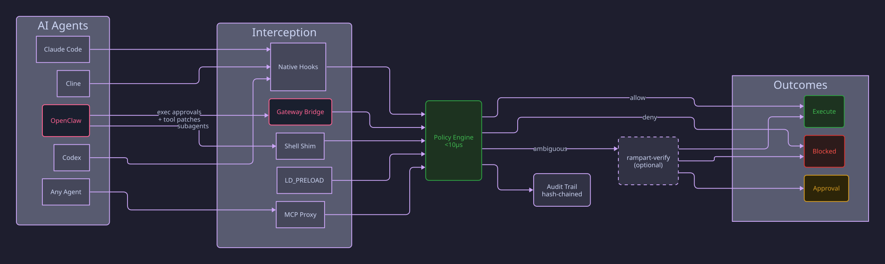
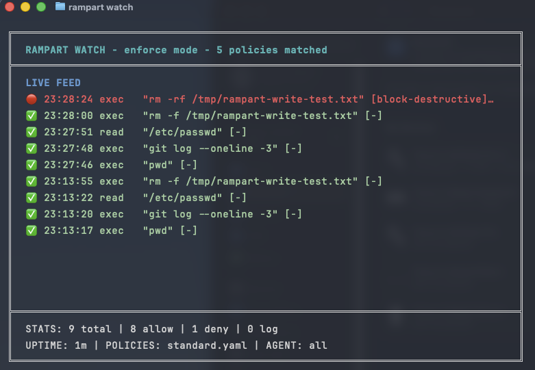

<div align="center">

# Rampart

**A firewall for AI coding agents.**

[](https://go.dev)
[](LICENSE)
[](https://github.com/peg/rampart/actions/workflows/ci.yml)
[](https://github.com/peg/rampart/releases)
[](https://docs.rampart.sh)

</div>

---

Claude Code's `--dangerously-skip-permissions` mode, and similar autonomous modes in Cline and Codex, give agents unrestricted shell access. Your agent can read your SSH keys, exfiltrate your `.env`, or `rm -rf /` with no guardrails.

Rampart evaluates the actions an agent exposes through a supported hook,
plugin, proxy, or process boundary. Matching shell commands, file operations,
fetches, and other tool calls can be blocked before the host executes them.
Rampart does not see arbitrary syscalls or network traffic inside a process you
already allowed; read the [threat model](docs/THREAT-MODEL.md) for the boundary.

---

## Install

```bash
# Homebrew (macOS and Linux, recommended)
brew install peg/tap/rampart

# One-line install (no sudo required)
curl -fsSL https://rampart.sh/install | bash

# Go install (requires Go 1.25.12+)
go install github.com/peg/rampart/cmd/rampart@latest
```

**Windows (PowerShell):**
```powershell
irm https://rampart.sh/install.ps1 | iex
```

> **Upgrading from Rampart 1.2.x on Windows?** Rerun the PowerShell installer above. It repairs the affected legacy `~\.rampart` ACL before replacing the binary. If that directory is locked, `rampart upgrade` may be unable to start and cannot perform the repair itself.

For an unattended OpenClaw agent, the zero-configuration path is:

```bash
rampart protect openclaw
```

---

## Quick start

Protect OpenClaw with managed defaults—no policy file to read or write:

```bash
rampart protect openclaw
```

This installs the native plugin and local service, activates fail-closed Guard
defaults, restarts the gateway, and runs safe behavioral canaries through the
live `before_tool_call` path. It does not ask the model to run anything.

Recheck the boundary at any time:

```bash
rampart verify openclaw
```

Other integrations currently use the setup workflow:

```bash
# Claude Code
rampart setup claude-code

# Hermes Agent (experimental)
rampart setup hermes

# Cline
rampart setup cline

# Codex CLI, IDE extension, and desktop app
rampart setup codex
rampart verify codex

# Any other agent (wraps $SHELL)
rampart wrap -- your-agent
```

Check the broader installation state:

```bash
rampart doctor
```

Current integration coverage, live-host evidence, and known gaps are published
in the [support matrix](https://docs.rampart.sh/getting-started/support-matrix/)
and [security-assurance guide](https://docs.rampart.sh/getting-started/security-assurance/).

Then watch your agent in real time:

```bash
rampart watch
```

### Optional persistent local config

If you do not want to keep exporting environment variables, Rampart also supports
`~/.rampart/config.yaml` for local defaults:

```yaml
url: http://127.0.0.1:9090
# serve_url: http://127.0.0.1:9090   # compatibility alias for url
# api: http://127.0.0.1:9091         # optional advanced override for daemon/split-topology API setups
```

| Setting | Use it for | Notes |
| --- | --- | --- |
| `url` | Primary Rampart base URL | Canonical setting for hook/watch/plugin/service-backed flows |
| `serve_url` | Backwards-compatible alias for `url` | Kept for compatibility; prefer `url` in new configs |
| `api` | Optional API base URL override for approval/control commands | Advanced only; usually unnecessary unless you split the API away from the main serve endpoint |

Notes:
- `url` is the main knob; use this unless you have a specific reason not to.
- `api` is **not** the normal setting for `rampart serve`; it is for advanced daemon/split-topology setups.
- Client-side `--api` flags expect an **API base URL** (`http://127.0.0.1:9091`), while daemon/server `--api` flags refer to an **API listen address** (`127.0.0.1:9091`).

Resolution order is: flag → environment → config file → auto-discovered state → default.

Once an integration is configured, each tool call that integration exposes to
Rampart goes through the policy engine:

```
ALLOW 14:23:01  exec  "npm test"                      [allow-dev]
ALLOW 14:23:03  read  ~/project/src/main.go            [default]
DENY  14:23:05  exec  "rm -rf /tmp/*"                  [block-destructive]
LOG   14:23:08  exec  "curl https://api.example.com"   [log-network]
ASK   14:23:10  exec  "kubectl apply -f prod.yaml"     [ask]
DENY  14:23:12  resp  read .env                        [block-credential-leak]
                  -> blocked: response contained AWS_SECRET_ACCESS_KEY
```

---

## How it works



Local pattern matching is benchmarked in microseconds. The optional
[rampart-verify](https://github.com/peg/rampart-verify) sidecar adds LLM-based
classification for selected ambiguous commands. Decisions observed at the
configured Rampart boundary are written to a hash-chained audit trail.

| Agent | Setup command | Integration |
|-------|--------------|-------------|
| **Claude Code** | `rampart setup claude-code` | Native pre/post tool hooks via `~/.claude/settings.json` |
| **OpenClaw** | `rampart protect openclaw` | Zero-config native guard + active verification |
| **Hermes Agent** | `rampart setup hermes` | Experimental `pre_tool_call` user plugin |
| **Cline** | `rampart setup cline` | Native hooks via settings |
| **Codex** | `rampart setup codex` | Native user-level lifecycle hooks for CLI, IDE, and desktop |
| **Any agent** | `rampart wrap -- <agent>` | Shell wrapping via `$SHELL` |
| **MCP servers** | `rampart mcp -- <server>` | MCP protocol proxy |
| **System-wide** | `rampart preload -- <cmd>` | LD_PRELOAD syscall interception |

<div align="center">

</div>

<details>
<summary><strong>Table of Contents</strong></summary>

**Getting Started:** [Install](#install) · [Quick start](#quick-start) · [Claude Code](#claude-code) · [OpenClaw](#openclaw) · [Hermes Agent](#hermes-agent-experimental) · [Wrap any agent](#wrap-any-agent)

**Core Features:** [Policies](#writing-policies) · [Approval flow](#approval-flow) · [Audit trail](#audit-trail) · [Live dashboard](#live-dashboard) · [Webhook notifications](#webhook-notifications)

**Advanced:** [LD_PRELOAD](#protect-any-process-ld_preload) · [MCP proxy](#protect-mcp-servers) · [SIEM integration](#siem-integration) · [Webhook actions](#webhook-actions) · [Preflight API](#preflight-api)

**Reference:** [Performance](#performance) · [Security](#security-recommendations) · [OWASP coverage](#owasp-coverage) · [CLI reference](#cli-reference) · [Compatibility](#compatibility) · [Building from source](#building-from-source)

</details>

---

## Claude Code

Native integration through Claude Code's hook system. Rampart classifies the
current hook-visible shell, file, network, MCP, delegation, transfer, and
scheduling tools before execution. In enforce mode, a future unknown
`PreToolUse` tool fails closed until Rampart is updated. Successful tool responses are scanned and
policy-blocked string content is replaced before the next model turn:

```bash
# Optional: dashboard and service-backed/headless approval features
rampart serve install

# Wire up hooks
rampart setup claude-code
```

Then use Claude Code normally. Rampart runs invisibly in the background.

To remove:
```bash
rampart setup claude-code --remove
```

---

## OpenClaw

OpenClaw is Rampart's first zero-configuration protection target:

```bash
rampart protect openclaw
```

The command installs and enables the native plugin, restores Rampart's managed
OpenClaw and Guard policies, starts the background service, enables fail-closed
degraded behavior, restarts the gateway, and actively verifies the result.
Existing unrelated OpenClaw settings and custom Rampart policies are preserved.

The managed Guard defaults focus on consequences:

- routine local work continues without prompts
- destructive commands and credential access are denied
- publishing, deployment, privileged service changes, and cross-conversation messages require approval
- read-only message actions and replies to the originating conversation remain available
- with the managed `failOpen: false` setting, the plugin returns a deny for
  tool requests when the policy service is unavailable

`rampart verify openclaw` uses fixed safe canaries. It traverses the running
plugin's normalization, message classification, policy request, degraded-mode,
and decision-mapping code without executing a command, reading a file, sending a
message, contacting an external host, or adding verification noise to the audit
log. Verification requires Rampart's local admin token and rejects incomplete or
stale plugin self-reports.

`rampart serve` is part of this path. The plugin calls the local Rampart service for policy evaluation, approvals, and audit flow.

### How exec approvals work

Rampart leaves global `tools.exec.ask` set to `"off"`, so routine shell commands do not spam you with approval prompts. When a Rampart policy returns `ask`, the plugin returns OpenClaw's native `requireApproval` result for that specific tool call.

In practice, that means:

- safe commands run normally, with no prompt
- denied commands are blocked immediately
- only commands that match a Rampart `ask` rule show an OpenClaw approval card

### What the plugin protects

**1. Native plugin**: evaluates tool calls in `before_tool_call`, blocks deny decisions immediately, and routes selective approvals through OpenClaw's native approval UI.

**2. Selective native approvals**: Rampart decides when an action should require approval, and OpenClaw shows the approval card only for those matched calls.

**3. Managed Guard defaults**: layers consequence-oriented safeguards over the OpenClaw profile without requiring YAML configuration.

For advanced/manual integration work, `rampart setup openclaw` remains available.

### Legacy compatibility path

`rampart setup openclaw --patch-tools` still exists as a compatibility option for older setups, but it is no longer the recommended path. It modifies OpenClaw dist files and must be re-applied after upgrades.

Run `rampart verify openclaw` to test behavior; use `rampart doctor` for a wider configuration health report.

---

## Hermes Agent (experimental)

Hermes Agent integration uses a user plugin installed into `~/.hermes/plugins/rampart`:

```bash
rampart setup hermes
hermes plugins enable rampart
```

The plugin registers a Hermes `pre_tool_call` hook and sends sanitized tool metadata to Rampart before execution. It defaults to `/v1/preflight/{tool}` so early tests do not create hidden approvals that Hermes cannot resume. `ask` decisions block with an approval-required message until Hermes has a first-class plugin approval/resume flow.

---

## Wrap any agent

For agents without a hook system, `wrap` sets `$SHELL` to a policy-checking shim. Works with any agent that reads `$SHELL` (Aider, OpenCode, Continue, and more):

```bash
rampart wrap -- aider
rampart wrap -- opencode
rampart wrap -- python my_agent.py
```

---

## Add preload coverage to a process

For agents with no hook system and no `$SHELL` support, `preload` intercepts exec-family syscalls at the OS level:

```bash
rampart preload -- your-agent
rampart preload -- python my_agent.py
rampart preload -- node agent.js

# Monitor mode: log only, no blocking
rampart preload --mode monitor -- risky-tool
```

Intercepts `execve`, `execvp`, `system()`, `popen()`, and `posix_spawn()`. Denied calls return `EPERM`.

**Platform notes:** Preload mode covers supported exec-family calls made through
the dynamic loader on Linux and in non-SIP-protected macOS processes. Static or
setuid binaries, direct syscalls, and macOS SIP-protected processes can bypass
this boundary; see the threat model before relying on preload mode.

---

## Protect MCP servers

Drop-in proxy between your agent and any MCP server:

```bash
rampart mcp -- npx @modelcontextprotocol/server-filesystem /path
```

In your MCP config (Claude Desktop, etc.):

```json
{
  "mcpServers": {
    "filesystem": {
      "command": "rampart",
      "args": ["mcp", "--", "npx", "@modelcontextprotocol/server-filesystem", "."]
    }
  }
}
```

Auto-generate policies from an MCP server's tool list:

```bash
rampart mcp scan -- npx @modelcontextprotocol/server-filesystem .
```

---

## Writing policies

Policies are YAML. Glob matching, hot-reload on file change.

> `rampart setup` creates `~/.rampart/policies/custom.yaml` as a starter template. It's never overwritten by upgrades.

```yaml
version: "1"
default_action: allow

policies:
  - name: block-destructive
    match:
      tool: ["exec"]
    rules:
      - action: deny
        when:
          command_matches: ["rm -rf *", "mkfs.*", "dd if=*", ":(){ :|:& };:"]
        message: "Destructive command blocked"

  - name: block-credential-reads
    priority: 1
    match:
      tool: ["read"]
    rules:
      - action: deny
        when:
          path_matches: ["**/.ssh/id_*", "**/.aws/credentials", "**/.env"]
        message: "Credential access blocked"

  - name: block-exfil
    match:
      tool: ["fetch"]
    rules:
      - action: deny
        when:
          domain_matches: ["*.ngrok-free.app", "*.requestbin.com", "webhook.site"]
        message: "Exfiltration domain blocked"
```

Use `command_contains` for substring matching (case-insensitive):

```yaml
  - name: block-dangerous-substrings
    match:
      tool: ["exec"]
    rules:
      - action: deny
        when:
          command_contains: ["DROP TABLE", "rm -rf"]
        message: "Dangerous substring detected"
```

Use `action: ask` to trigger an approval prompt:

```yaml
  - name: ask-before-sudo
    match:
      agent: ["claude-code"]
      tool: ["exec"]
    rules:
      - action: ask
        when:
          command_contains: ["sudo "]
        message: "This command needs your approval"
```

**No YAML editing required for common cases.** When a command is blocked, Rampart suggests what to run:

```bash
# When "npm install lodash" gets denied:
#   💡 To allow this: rampart allow "npm install *"
rampart allow "npm install *"
#  Rule added; policy reloaded (12 rules active)
```

**Evaluation:** Deny always wins. Lower priority number = evaluated first. Four actions: `deny`, `ask`, `watch`, `allow`.

### Project-local policies

Drop `.rampart/policy.yaml` in any git repo for project-specific rules. Commit it so every team member gets the same rules automatically:

```bash
rampart init --project
```

**Security note:** Set `RAMPART_NO_PROJECT_POLICY=1` to skip project policy loading when working in untrusted repos.

### Built-in profiles

```bash
rampart init --profile standard    # allow-by-default, blocks dangerous commands
rampart init --profile paranoid    # deny-by-default, explicit allowlist
rampart init --profile ci          # strict; all approvals become hard denies
rampart init --profile yolo        # log-only, no blocking
```

---

## Approval flow

For commands that need a human to decide:

```yaml
policies:
  - name: production-deploys
    match:
      tool: ["exec"]
    rules:
      - action: ask
        when:
          command_matches: ["kubectl apply *", "terraform apply *"]
        message: "Production deployment requires approval"
```

How approval reaches you depends on your environment:

| Environment | How you approve |
|-------------|----------------|
| Claude Code | Native approval prompt in the terminal |
| OpenClaw | Native approval card in your connected chat surface |
| Any | `rampart approve <id>` via CLI, dashboard, or signed URL |

```bash
rampart pending          # What's waiting
rampart approve abc123   # Let it through
rampart deny abc123      # Block it
```

Pending approvals expire after 2 minutes by default (`--approval-timeout` to change).

---

## Audit trail

Each tool decision Rampart receives is logged to hash-chained JSONL. Editing,
inserting, or deleting an individual record breaks chain verification:

```bash
rampart audit tail --follow    # Stream events
rampart audit verify           # Check chain integrity
rampart audit stats            # Decision breakdown
rampart audit search           # Query by tool, agent, decision, time range
```

---

## Live dashboard

```bash
rampart watch           # TUI: live colored event stream
```

Web dashboard at **http://localhost:9090/dashboard/** when `rampart serve` is running. Three tabs: live stream, history, and a policy REPL to test commands before they run.

---

## Webhook notifications

```yaml
notify:
  url: "https://discord.com/api/webhooks/your/webhook"
  on: ["deny"]

policies:
  # ...
```

Works with Discord webhooks, Slack incoming webhooks, or any HTTP endpoint.

---

## SIEM integration

```bash
# RFC 5424 syslog (Wazuh, QRadar, ArcSight, Sentinel)
rampart serve --syslog localhost:514

# Common Event Format (Splunk, QRadar)
rampart serve --syslog localhost:514 --cef
```

---

## Webhook actions

Delegate allow/deny decisions to an external service:

```yaml
rules:
  - action: webhook
    when:
      command_matches: ['*production*']
    webhook:
      url: 'http://localhost:8090/verify'
      timeout: 5s
      fail_open: true
```

See [rampart-verify](https://github.com/peg/rampart-verify), an optional LLM sidecar for ambiguous commands (~$0.0001/call).

---

## Preflight API

Check if a call would be allowed without executing it:

```bash
curl -s localhost:9090/v1/preflight/exec \
  -H "Authorization: Bearer $TOKEN" \
  -d '{"agent":"a","session":"s","params":{"command":"rm -rf /"}}'
# → {"allowed":false,"decision":"deny","matched_policies":["block-destructive"]}
```

---

## Performance

Policy evaluation is benchmarked in microseconds on maintainer and CI hardware.
Exact latency depends on the policy set, machine, and audit path:

| Command | Decision | Time |
|---------|----------|------|
| `rm -rf /` | deny | 8µs |
| `sudo reboot` | watch | 6µs |
| `.ssh/id_rsa` read | deny | 3µs |
| `git status` | allow | 4µs |
| `curl ngrok.io` | deny | 3µs |

---

## Security recommendations

**Self-modification protection.** The standard profile blocks recognized
agent-issued Rampart mutation commands and writes to known Rampart paths.
This is defense in depth, not an OS isolation boundary: keep policy files and
admin credentials outside the agent account for stronger protection.

**Don't run your AI agent as root.** Root access defeats user separation. Run agent frameworks as an unprivileged user.

**Run `rampart serve` as a separate user** in production to prevent agents from reading audit logs or modifying policies.

For a full discussion of the threat model, see [`docs/THREAT-MODEL.md`](docs/THREAT-MODEL.md).

---

## OWASP coverage

Rampart maps to the [OWASP Top 10 for Agentic Applications](https://genai.owasp.org/resource/owasp-top-10-for-agentic-applications-for-2026/):

| Risk | Coverage |
|------|----------|
| **ASI02: Tool Misuse** | Partial: supported host-exposed tool calls are policy evaluated |
| **ASI05: Unexpected Code Execution** | Partial: command patterns and optional semantic verification; allowed interpreters remain a boundary |
| **ASI08: Data Exfiltration** | Partial: known domains, file paths, and credential patterns |
| **ASI09: Human-Agent Trust** | Partial: `ask` where the integration has an approval path |
| **ASI10: Rogue Agents** | Partial: observed actions are audited; Rampart is not process isolation |
| **ASI01: Goal Hijack** | Partial: policy limits blast radius even if goals are altered |
| **ASI06: Context Poisoning** | Partial: response scanning blocks credentials from context window |
| **ASI07: Inter-Agent Communication** | ❌ Not addressed |

[Full OWASP mapping →](https://docs.rampart.sh/reference/owasp-mapping/)

---

## CLI reference

```bash
# Setup
rampart protect openclaw                    # Zero-config guard + live behavioral verification
rampart verify openclaw                     # Re-run safe canaries through the live plugin
rampart quickstart                           # Auto-detect, install, configure, health check
rampart setup claude-code                    # Claude Code native hooks
rampart setup cline                          # Cline native hooks
rampart setup openclaw                       # OpenClaw native plugin integration
rampart setup codex                          # Codex native lifecycle hooks
rampart verify codex                         # Verify hook install + native deny response
rampart setup <agent> --remove               # Clean uninstall

# Run
rampart wrap -- <command>                    # Wrap any agent via $SHELL
rampart preload -- <command>                 # LD_PRELOAD syscall interception
rampart mcp -- <mcp-server-command>          # Proxy MCP with policy enforcement
rampart mcp scan -- <server>                 # Auto-generate policies from MCP tools

# Serve
rampart serve [--port 9090]                  # Start approval + dashboard server
rampart serve install                        # Install as a boot service (systemd/launchd)
rampart serve --background                   # Start in background
rampart serve stop                           # Stop background server

# Diagnose
rampart doctor                               # Health check (colored output)
rampart doctor --fix                         # Auto-apply missing patches
rampart doctor --json                        # Machine-readable (exit 1 on issues)
rampart status                               # Quick dashboard: what's protected
rampart watch                                # Live TUI event stream

# Policy
rampart init [--profile standard|paranoid|ci|yolo]   # Initialize global policy
rampart init --project                                # Create .rampart/policy.yaml
rampart policy lint [file]                            # Lint policy file
rampart policy explain "git status"                   # Trace evaluation
rampart policy list                                   # Browse community registry
rampart policy fetch <name>                           # Install community policy

# Rules (no YAML editing required)
rampart allow "npm install *"               # Allow a command pattern
rampart block "curl * | bash"               # Block a pattern
rampart rules                               # List custom rules
rampart rules remove 3                      # Remove by number
rampart allow "docker *" --for 1h          # Temporary allow

# Test
rampart test "rm -rf /"                     # Dry-run against policies
rampart test --json                         # Structured output for CI

# Approvals
rampart pending                             # What's waiting
rampart approve <id>                        # Allow
rampart deny <id>                           # Deny

# Audit
rampart audit tail [--follow]
rampart audit verify
rampart audit stats
rampart log --deny                          # Recent denies

# Upgrade
rampart upgrade                             # New binary + refresh policies
rampart upgrade --no-binary                 # Refresh policies only
```

---

## Compatibility

| Agent | Method | Platforms |
|-------|--------|-----------|
| Claude Code | `rampart setup claude-code` | Linux, macOS, Windows |
| OpenClaw | `rampart protect openclaw` | Linux, macOS |
| Cline | `rampart setup cline` | Linux, macOS |
| Codex CLI, IDE, desktop | `rampart setup codex` | Linux, macOS, Windows |
| Claude Desktop MCP servers | `rampart mcp` | Linux, macOS, Windows |
| Aider, OpenCode, Continue | `rampart wrap` | Linux, macOS |
| Python agents | `rampart preload` or HTTP API | Linux, macOS |
| Node.js agents | `rampart preload` or HTTP API | Linux, macOS |
| Command-launched MCP servers | `rampart mcp` | Linux, macOS, Windows |
| Supported dynamically linked processes | `rampart preload` | Linux, macOS |
| Custom agents | HTTP API at `localhost:9090` | Linux, macOS, Windows |

---

## Building from source

```bash
git clone https://github.com/peg/rampart.git
cd rampart
go build -o rampart ./cmd/rampart
go test ./...
```

Requires Go 1.25.12+.

---

## Upgrading from v0.9.8?

v0.9.9 contains three breaking changes:

**`action: require_approval` is now a hard error.**
Update your policies from:
```yaml
- action: require_approval
```
to:
```yaml
- action: ask
  ask:
    audit: true
```
Run `rampart policy lint` to find all occurrences.

**`--serve-token` flag removed.**
Use the `RAMPART_TOKEN` environment variable instead:
```bash
# Before (v0.9.8 and earlier)
rampart serve --serve-token mysecrettoken

# After (v0.9.9+)
RAMPART_TOKEN=mysecrettoken rampart serve
```

**`GET /v1/policy` endpoint removed.**
Use `GET /v1/status` for server health or `GET /v1/policies` to list active policies.

---

## Companion Tool: Snare

Rampart blocks. [Snare](https://snare.sh) catches.

Snare plants canary tokens in your AI agent's environment - API keys, cloud credentials, file paths. If your agent, or something that compromised it, uses those tokens, you get an instant alert.

**Rampart + Snare = preventive + detective controls.** Use both.

---

## Contributing

Contributions welcome. Open an issue first for anything beyond small fixes. All work goes through the `staging` branch. PRs to `main` require one approving review.

---

## License

[Apache 2.0](LICENSE)
