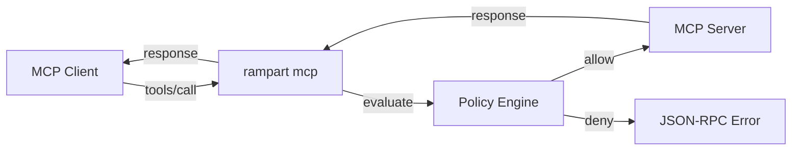

# MCP Proxy

Rampart can act as a transparent proxy between any MCP client and MCP server, evaluating every `tools/call` against your policies.

## Usage

```bash
# Wrap any MCP server
rampart mcp -- npx @modelcontextprotocol/server-filesystem /path

# Monitor mode (log only)
rampart mcp --mode monitor -- npx @modelcontextprotocol/server-fs .
```

## MCP Client Configuration

In your agent's MCP config (Claude Desktop, Cursor, etc.):

```json
{
  "mcpServers": {
    "filesystem": {
      "command": "rampart",
      "args": ["mcp", "--", "npx", "-y", "@modelcontextprotocol/server-filesystem", "."]
    }
  }
}
```

## How It Works



Rampart speaks the MCP protocol natively. The client and server don't know it's there. Denied tool calls return a standard JSON-RPC error — the MCP server never sees them.

## Auto-Generate Policies

Scan an MCP server's tool list and generate a deny-by-default policy:

```bash
rampart mcp scan -- npx @modelcontextprotocol/server-filesystem .
```

This creates a policy with an explicit rule for each tool. Review, customize, and deploy.

## MCP Tool Auto-Categorization

Rampart automatically categorizes MCP tools based on keywords in their names:

| Category | Keywords | Default Action |
|----------|----------|---------------|
| `mcp-destructive` | delete, destroy, remove, drop | `deny` |
| `mcp-dangerous` | stop, restart, execute, modify | `log` |

## Example: Proxmox MCP Policy

```yaml
version: "1"
default_action: allow

policies:
  - name: block-vm-destruction
    match:
      tool: ["mcp__proxmox__vm_delete", "mcp__proxmox__snapshot_delete"]
    rules:
      - action: deny
        message: "VM/snapshot deletion blocked by policy"

  - name: log-vm-power
    match:
      tool: ["mcp__proxmox__vm_stop", "mcp__proxmox__vm_shutdown"]
    rules:
      - action: log
        message: "VM power operation logged"

  - name: block-disk-resize
    match:
      tool: ["mcp__proxmox__vm_resize_disk"]
    rules:
      - action: deny
        message: "Disk resize blocked — irreversible operation"
```
