# Policy Engine

Rampart's policy engine evaluates every AI agent tool call against YAML rules in single-digit microseconds. No network calls, no external dependencies — just fast pattern matching.

## Evaluation Flow

```mermaid
graph TD
    TC[Tool Call] --> M{Match policies<br/>by tool type}
    M --> R[Evaluate rules<br/>top-to-bottom]
    R --> D{Any deny?}
    D -->|Yes| DENY[❌ Denied]
    D -->|No| AP{Any require_approval?}
    AP -->|Yes| APPROVAL[👤 Pending Approval]
    AP -->|No| L{Any log?}
    L -->|Yes| LOG[🟡 Logged + Allowed]
    L -->|No| A{Any allow?}
    A -->|Yes| ALLOW[✅ Allowed]
    A -->|No| DEF[Default Action]
    DENY --> AU[Audit Trail]
    APPROVAL --> AU
    LOG --> AU
    ALLOW --> AU
    DEF --> AU

    style DENY fill:#da3633,stroke:#fff,color:#fff
    style APPROVAL fill:#d29922,stroke:#fff,color:#fff
    style ALLOW fill:#238636,stroke:#fff,color:#fff
```



### Evaluation Order

1. **Collect** all policies whose `match` clause fits the tool call
2. **Within each policy**, rules evaluate top-to-bottom (first match wins)
3. **Across policies**: any `deny` → denied. No deny + any `log` → logged. Only `allow` → allowed
4. **Nothing matches** → configurable default action (`allow` or `deny`)

**Deny always wins.** If any policy says deny, the call is denied. No override, no ambiguity.

## Pattern Matching

### Glob Syntax

Rampart uses glob patterns for matching:

| Pattern | Matches |
|---------|---------|
| `*` | Any sequence of characters (single path segment) |
| `**` | Any sequence of characters (crosses path separators) |
| `?` | Any single character |

### Examples

```yaml
command_matches:
  - "rm -rf *"      # rm -rf followed by anything
  - "kubectl * -n production"  # kubectl commands in production namespace

path_matches:
  - "**/.ssh/id_*"  # SSH keys anywhere in the filesystem
  - "*.env"         # .env files in current directory
  - "**/.env"       # .env files anywhere

domain_matches:
  - "*.ngrok-free.app"  # All ngrok subdomains
  - "webhook.site"      # Exact domain match
```

## Tool Types

| Tool | Trigger | Available Matchers |
|------|---------|-------------------|
| `exec` | Shell commands | `command_matches` |
| `read` | File reads | `path_matches`, `path_not_matches` |
| `write` | File writes | `path_matches`, `path_not_matches` |
| `fetch` | HTTP requests | `domain_matches` |
| MCP tools | MCP `tools/call` | Tool name matching + `command_matches` |

## Actions

### `deny`

Block the tool call. The agent receives an error with the policy's `message` field.

### `allow`

Permit the tool call. Logged at default level.

### `log`

Permit but flag for review. Shows with 🟡 in `rampart watch`.

### `require_approval`

Block until a human approves:

```yaml
rules:
  - action: require_approval
    when:
      command_matches: ["kubectl apply *", "terraform apply *"]
    message: "Production deployment requires approval"
```

```bash
rampart pending          # What's waiting
rampart approve abc123   # Let it through
rampart deny abc123      # Block it
```

### `webhook`

Delegate the decision to an external HTTP endpoint:

```yaml
rules:
  - action: webhook
    when:
      command_matches: ['*production*']
    webhook:
      url: 'http://localhost:8090/verify'
      timeout: 5s
      fail_open: true
```

The webhook receives the full tool call context and returns `{"decision": "allow"}` or `{"decision": "deny", "reason": "..."}`.

## Response-Side Evaluation

Rampart can also scan tool output for sensitive patterns:

```yaml
rules:
  - action: deny
    when:
      response_matches:
        - "AKIA[0-9A-Z]{16}"                    # AWS access key
        - "-----BEGIN (RSA )?PRIVATE KEY-----"   # Private key
        - "ghp_[a-zA-Z0-9]{36}"                 # GitHub PAT
```

This catches accidental credential leaks in command output.

## MCP Tool Matching

For MCP servers, Rampart auto-categorizes tools:

- Tools with destructive keywords (`delete`, `destroy`, `remove`, `drop`) → `mcp-destructive`
- Tools with dangerous keywords (`stop`, `restart`, `execute`, `modify`) → `mcp-dangerous`

```yaml
policies:
  - name: block-mcp-destructive
    match:
      tool: ["mcp-destructive"]
    rules:
      - action: deny
        message: "Destructive MCP operation blocked"
```

You can also match specific MCP tool names:

```yaml
policies:
  - name: block-vm-deletion
    match:
      tool: ["mcp__proxmox__vm_delete"]
    rules:
      - action: deny
        message: "VM deletion blocked"
```

## Performance

| Command | Decision | Time |
|---------|----------|------|
| `rm -rf /` | deny | 8μs |
| `sudo reboot` | log | 6μs |
| `.ssh/id_rsa` read | deny | 3μs |
| `git status` | allow | 4μs |
| `curl ngrok.io` | deny | 3μs |

Policy evaluation is pure in-memory pattern matching. No disk I/O, no network calls, no external processes.

## Hot Reload

Policies hot-reload via `fsnotify`. Edit the YAML file and changes take effect immediately — no restart required.
