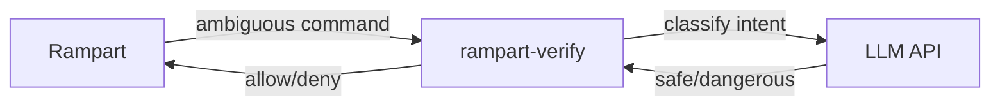

# Semantic Verification

Pattern matching handles 95%+ of decisions. For the ambiguous 5%, Rampart supports LLM-based intent classification via the optional **rampart-verify** sidecar.

## The Problem

Pattern matching is fast and reliable for known-dangerous commands (`rm -rf /`, credential access). But some commands are ambiguous:

- `python3 -c "import os; os.system('...')"` — dangerous or benign?
- `curl https://internal-api.company.com/admin` — legitimate or exfiltration?
- `find / -name "*.pem" -exec cat {} \;` — auditing or credential theft?

## rampart-verify

[**rampart-verify**](https://github.com/peg/rampart-verify) is a standalone sidecar that classifies ambiguous commands using LLMs. It runs as a local HTTP server and integrates with Rampart via the `webhook` action.

### Supported Models

- **OpenAI**: gpt-4o-mini (recommended for cost)
- **Anthropic**: Claude Haiku
- **Ollama**: Any local model (fully offline)

### Cost

~$0.0001 per classification with gpt-4o-mini. Pattern matching handles the bulk for free; the sidecar only sees commands that need semantic analysis.

## Setup

```bash
# Clone and install
git clone https://github.com/peg/rampart-verify.git
cd rampart-verify
pip install -r requirements.txt

# Start the sidecar
python main.py --port 8090
```

Set your LLM provider via environment variables:

```bash
export VERIFY_PROVIDER=openai
export OPENAI_API_KEY=sk-...
```

For fully offline operation, use Ollama:

```bash
export VERIFY_PROVIDER=ollama
export OLLAMA_MODEL=qwen2.5-coder:1.5b
```

### Configure Rampart

Route ambiguous commands to the sidecar:

```yaml
policies:
  - name: verify-ambiguous
    match:
      tool: ["exec"]
    rules:
      - action: webhook
        when:
          command_matches:
            - "python3 -c *"
            - "python3 -m *"
            - "node -e *"
            - "eval *"
            - "base64 *"
        webhook:
          url: 'http://localhost:8090/verify'
          timeout: 5s
          fail_open: true
```

## How It Works



1. Rampart's pattern matching can't decide → routes to webhook
2. rampart-verify sends the command to the configured LLM
3. LLM classifies the intent (not just the syntax)
4. rampart-verify returns `allow` or `deny`
5. The decision is logged to Rampart's audit trail

**Fail-open by default.** If rampart-verify is down or the LLM times out, the command is allowed. Configure `fail_open: false` for stricter environments.

## Two-Layer Defense

| Layer | Speed | Coverage | Handles |
|-------|-------|----------|---------|
| Pattern matching | ~5μs | Known patterns | `rm -rf /`, credential paths, known exfil domains |
| Semantic verification | ~500ms | Intent analysis | Obfuscated commands, encoded payloads, ambiguous scripts |

The two layers are complementary. Patterns catch the obvious cases instantly. The LLM catches intent regardless of how the command is formatted.
