---
hide:
  - navigation
  - toc
---

<div class="hero-title" markdown>

# Rampart

</div>

<p class="hero-subtitle">Open-source firewall for AI agents. See everything your AI does. Block the dangerous stuff.</p>

---

## What is Rampart?

Rampart is a **policy engine** that sits between AI agents and the tools they use. Every command, file access, and network request gets evaluated against your YAML policies before it executes. Dangerous actions get blocked in microseconds. Everything gets logged to a tamper-evident audit trail where each entry is cryptographically linked to the previous one — if anyone tampers with a record, the chain breaks.

<div class="grid cards" markdown>

-   :material-shield-check:{ .lg .middle } **Policy Engine**

    ---

    YAML-based policies with glob matching. Deny, allow, log, or require human approval. Evaluates in **<10μs**.

    [:octicons-arrow-right-24: Learn more](features/policy-engine.md)

-   :material-lock:{ .lg .middle } **Audit Trail**

    ---

    Tamper-evident logs where every entry is linked to the last. Daily rotation, search, and verification built in.

    [:octicons-arrow-right-24: Learn more](features/audit-trail.md)

-   :material-bell-ring:{ .lg .middle } **Real-time Alerts**

    ---

    Webhook notifications to Discord, Slack, or Teams when something gets blocked. Export to security monitoring tools (Splunk, Wazuh, etc.) via syslog.

    [:octicons-arrow-right-24: Learn more](features/webhooks.md)

-   :material-connection:{ .lg .middle } **Universal Integration**

    ---

    Native hooks, shell wrapping, MCP proxy, system-level interception, HTTP API. Works with every major AI agent.

    [:octicons-arrow-right-24: Integration guides](integrations/index.md)

</div>

## Quick Start

```bash
# Install
brew tap peg/rampart && brew install rampart

# Protect Claude Code (one command)
rampart setup claude-code

# Use Claude Code normally — Rampart is transparent
claude
```

That's it. Every tool call now goes through Rampart's policy engine. [Full setup guide →](getting-started/quickstart.md)

## How It Works

```mermaid
graph LR
    subgraph "AI Agents"
        CC[Claude Code]
        CL[Cline]
        OC[OpenClaw]
        CX[Codex]
        O[Others]
    end

    CC & CL --> H[Native Hooks]
    OC --> S[Shell Shim]
    CX --> P[LD_PRELOAD]
    O --> M[MCP Proxy]

    H & S & P & M --> PE[YAML Policy Eval<br/>~20μs]

    PE --> AU[📋 Hash-Chained Audit<br/>Syslog · CEF · Webhooks]

    AU --> PASS[✅ Execute]
    AU --> BLOCK[❌ Blocked]
    AU --> APR[👤 Approval]

    PE -. "ambiguous ⚠️" .-> SB["⚡ rampart-verify<br/>(optional sidecar)<br/>gpt-4o-mini · Haiku · Ollama"]
    SB -. allow/deny .-> PE

    style PE fill:#238636,stroke:#fff,color:#fff
    style AU fill:#1f6feb,stroke:#fff,color:#fff
    style BLOCK fill:#da3633,stroke:#fff,color:#fff
    style APR fill:#d29922,stroke:#fff,color:#fff
    style PASS fill:#238636,stroke:#fff,color:#fff
    style SB fill:#2d333b,stroke:#f0883e,stroke-width:2px,stroke-dasharray: 5 5
```



## Works With Every Agent

| Agent | Integration | Setup |
|-------|------------|-------|
| **Claude Code** | Native hooks | `rampart setup claude-code` |
| **Cline** | Native hooks | `rampart setup cline` |
| **Cursor** | MCP proxy | `rampart mcp --` |
| **Claude Desktop** | MCP proxy | `rampart mcp --` |
| **Codex CLI** | LD_PRELOAD | `rampart preload --` |
| **OpenClaw** | Shim + service | `rampart setup openclaw` |
| **Any CLI agent** | Shell wrapper | `rampart wrap --` |
| **Python agents** | HTTP API / SDK | `localhost:9090` |

[:octicons-arrow-right-24: See all integration guides](integrations/index.md)
