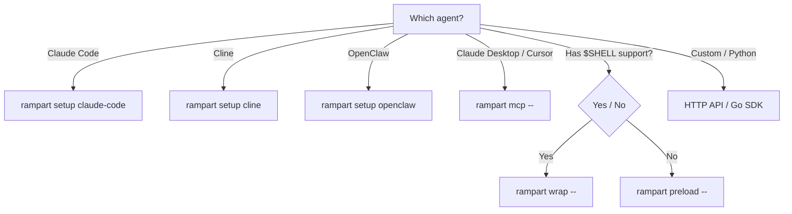

# Integration Guides

Rampart works with every major AI agent through multiple integration methods. Choose the guide for your agent below.

## Integration Methods

| Method | How It Works | Best For |
|--------|-------------|----------|
| **Native Hooks** | Uses the agent's built-in hook system | Claude Code, Cline |
| **Shell Wrapper** | Sets `$SHELL` to a policy-checking shim | Aider, OpenCode, Continue |
| **MCP Proxy** | Transparent proxy for MCP tool calls | Claude Desktop, Cursor |
| **LD_PRELOAD** | Intercepts exec syscalls at the OS level | Codex CLI, any process |
| **HTTP API** | RESTful endpoint for custom integrations | Python agents, custom code |
| **Shim + Service** | Shell shim + background daemon | OpenClaw |
| **WebSocket Daemon** | WebSocket integration for real-time agents | OpenClaw (alternative) |

## require_approval Behavior

When a policy action is `require_approval`, behavior varies by integration:

| Integration | Behavior |
|-------------|----------|
| **Claude Code** | Hook returns `"permissionDecision":"ask"`, waits for resolution |
| **Cline** | Hook returns `{"cancel":true}` immediately (no waiting) |
| **MCP (Claude Desktop/Cursor)** | Proxy blocks, returns JSON-RPC error on deny |
| **OpenClaw** | Shim blocks, daemon sends webhook notifications |
| **Shell Wrapper** | Shim blocks, command appears "hung" until resolved |
| **LD_PRELOAD** | Library blocks exec call, process appears "hung" |
| **HTTP API** | Returns `"decision":"require_approval"` with `approval_id` |

## Agent Compatibility

| Agent | Method | Command | Platforms |
|-------|--------|---------|-----------|
| [Claude Code](claude-code.md) | Native hooks | `rampart setup claude-code` | All |
| [Cline](cline.md) | Native hooks | `rampart setup cline` | All |
| [Cursor](cursor.md) | MCP proxy | `rampart mcp --` | All |
| [Claude Desktop](claude-desktop.md) | MCP proxy | `rampart mcp --` | All |
| [Codex CLI](codex-cli.md) | LD_PRELOAD | `rampart preload --` | Linux, macOS |
| [OpenClaw](openclaw.md) | Shim + service | `rampart setup openclaw` | Linux, macOS |
| [Python Agents](python-agents.md) | HTTP API | `rampart serve` | All |
| [Any CLI Agent](any-cli-agent.md) | Shell wrapper | `rampart wrap --` | Linux, macOS |

## Choosing an Integration

!!! tip "Start with the simplest method"
    Native hooks > wrap > MCP proxy > preload > HTTP API. Use the first one that works for your agent.
